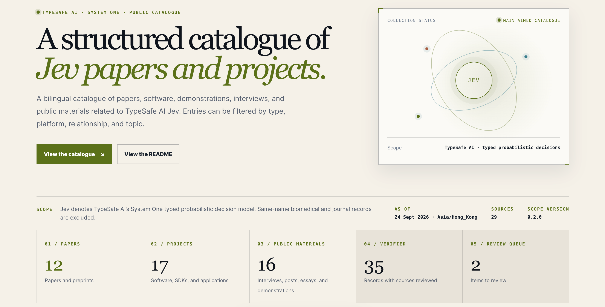

<p align="center">
  
</p>

<p align="center">
  <a href="https://agenticapp-web.github.io/Jev-Research-Index/"></a>
  <a href="https://github.com/AgenticAPP-Web/Jev-Research-Index/actions/workflows/deploy-pages.yml"></a>
  <a href="https://github.com/AgenticAPP-Web/Jev-Research-Index/actions/workflows/validate.yml"></a>
  
</p>

<p align="center"><strong>Live website:</strong> <a href="https://agenticapp-web.github.io/Jev-Research-Index/">https://agenticapp-web.github.io/Jev-Research-Index/</a></p>

<!-- CATALOGUE_STATS_START -->
**Catalogue size:** 18 papers · 361 projects · 125 public materials · 58 sources
<!-- CATALOGUE_STATS_END -->

# Jev Research Index

Jev Research Index is a bilingual catalogue of papers, software projects, interviews, public analyses, demonstrations, and social-media material related to **Jev**, the TypeSafe AI System One typed probabilistic decision model.

The site provides a structured reference for the Jev ecosystem. It is a static site designed for GitHub Pages; the data layer is plain JSON and can be reviewed without a database or application account.

## Scope

In this repository, **Jev** means TypeSafe AI’s System One decision model. Records about Japanese encephalitis virus, the Journal of Extracellular Vesicles, JEV vaccines, and other unrelated uses of the abbreviation are excluded and retained separately when an exclusion decision is useful for auditability.

The catalogue separates three collections:

- `papers`: papers and preprints;
- `projects`: SDKs, repositories, applications, and alternative implementations;
- `online-materials`: interviews, podcasts, blog posts, public analyses, videos, social posts, and channel-level records.

An online material is not treated as a paper or a software project. Interviews, videos, X/Twitter posts, third-party directories, and other public records are retained as source-linked materials with an explicit platform, author, canonical URL, relationship, evidence level, and verification date.

<!-- CATALOGUE_TABLES_START -->
## Catalogue snapshot

The following tables are generated from the JSON snapshots in this repository. They provide a compact Markdown index for reference and review; the website adds full summaries, filters, source notes, and bilingual display. Counts and dates refer to the snapshot labelled **2026-09-27** (Asia/Hong_Kong).

### Papers and preprints (18)

| Published | Work | Authors | Venue / type | Relationship | Evidence | Verified |
| --- | --- | --- | --- | --- | --- | --- |
| 2026-09-21 | [Jev for Scientific Decisions: Evaluating Semantic Choices and Their Consequences](https://arxiv.org/abs/2609.24965)<br><sub>Jev 在科学决策中的应用：语义选择及其后果评估</sub> | Boyuan Deng, Shuyi Fan, Hongyang Zhang, Xinhong Xie | arXiv · cs.CL / cs.AI<br><sub>应用实证 / 评测</sub> | Uses Jev | A — verified | 2026-09-24 |
| 2026-09-22 | [Visual Jev: Accurate and Efficient Decisions from Shared Visual Context](https://arxiv.org/abs/2609.25845)<br><sub>Visual Jev：共享视觉上下文下的准确高效决策</sub> | Guanxu Yu, Yuhang Yao | arXiv · cs.CV / cs.LG<br><sub>系统 / 视觉决策</sub> | Jev-inspired | A — verified | 2026-09-24 |
| 2026-09-19 | [Replacing Large Language Models with Jev Decision Models for Low-Latency Edge Service Orchestration](https://arxiv.org/abs/2609.22753)<br><sub>用 Jev 决策模型替代大语言模型进行低延迟边缘服务编排</sub> | Delong Li, Xu Wang, Haochen Gong, Rui Lang, Guangsheng Yu | arXiv · cs.DC / cs.NI<br><sub>系统实证 / 延迟评测</sub> | Uses Jev | A — verified | 2026-09-24 |
| 2026-09-21 | [Jev-Mem: System-One-Controlled Agentic Memory for Efficient AI Agents](https://arxiv.org/abs/2609.23986)<br><sub>Jev-Mem：由 System One 控制的高效智能体记忆</sub> | Dongming Jiang, Yi Li, Bingzhe Li | arXiv<br><sub>架构 / 智能体记忆</sub> | Jev-inspired | A — verified | 2026-09-24 |
| 2026-09-22 | [Type-Safe Is Not Error-Free: A Constrained Decision Head Follows the Option Name, Not the Rubric Bound to It](https://arxiv.org/abs/2609.26758)<br><sub>类型安全并非无错误：受约束决策头跟随选项名称，而非与其绑定的评判准则</sub> | Yu Sun, Junhao Xu | arXiv · cs.AI<br><sub>可靠性 / 受约束决策评测</sub> | Uses Jev | A — verified | 2026-09-24 |
| 2026-09-22 | [JEV-as-a-Judge: Accept When Confident, Escalate When Unsure](https://arxiv.org/abs/2609.26550)<br><sub>JEV-as-a-Judge：有信心时接受，不确定时升级</sub> | Yubo Li, Yidi Miao, Ramayya Krishnan, Rema Padman | arXiv · cs.AI<br><sub>评测 / 级联判定</sub> | Uses Jev | A — verified | 2026-09-24 |
| 2026-09-22 | [REFLEX with Jev for Efficient Selective Control in LLM Agents](https://arxiv.org/abs/2609.26532)<br><sub>使用 Jev 的 REFLEX：面向大语言模型智能体的高效选择性控制</sub> | Tiantong Wu, Wei Yang Bryan Lim | arXiv · cs.AI<br><sub>系统 / 选择性控制评测</sub> | Uses Jev | A — verified | 2026-09-24 |
| 2026-09-21 | [JEVQA - Video Quality from Metadata, Bitstream, and Pixel Features with a General-Purpose Decision Model](https://arxiv.org/abs/2609.24395)<br><sub>JEVQA：利用元数据、比特流和像素特征与通用决策模型评估视频质量</sub> | Werner Robitza | arXiv · eess.IV<br><sub>应用实证 / 视频质量</sub> | Uses Jev | A — verified | 2026-09-24 |
| 2026-09-21 | [Open-Jev Judgments on CallScreenBench: Calibrated One-Pass Scam Screening with a Small Language Model](https://arxiv.org/abs/2609.23959)<br><sub>CallScreenBench 上的 Open-Jev 判定：用小语言模型进行校准的单次诈骗筛查</sub> | Simiao Ren, Kidus Zewde, Xingyu Shen, Yuchen Zhou, Dennis Ng, Ankit Raj, Tommy Duong, Yuxin Zhang, Neo Tiangratanakul | arXiv · cs.CL<br><sub>开源复现 / 应用评测</sub> | Open replica | A — verified | 2026-09-24 |
| 2026-09-20 | [this-that-model-1.0: A typed decision model that decides in 30 ms, for a millionth of a cent](https://arxiv.org/abs/2609.23886)<br><sub>this-that-model-1.0：30 毫秒内、百万分之一美分完成决策的类型化决策模型</sub> | Zehua Cheng, Wei Dai, Jiahao Sun | arXiv · cs.CL<br><sub>替代模型 / 系统评测</sub> | Open replica | A — verified | 2026-09-24 |
| 2026-09-19 | [Fast Intent-Driven Service Orchestration with Jev for 6G Edge Networks](https://arxiv.org/abs/2609.23136)<br><sub>面向 6G 边缘网络的 Jev 快速意图驱动服务编排</sub> | Delong Li, Xu Wang, Haochen Gong, Rui Lang, Guangsheng Yu | arXiv · cs.NI<br><sub>系统实证 / 边缘服务编排</sub> | Uses Jev | A — verified | 2026-09-24 |
| 2026-09-21 | [Calibrated Decisions at Scale: Converting Police Crash Narratives into Probabilistic Crash Variables with a System One Model (Jev)](https://arxiv.org/abs/2609.24052)<br><sub>规模化校准决策：使用 System One 模型（Jev）将警察事故叙述转换为概率事故变量</sub> | Amir Rafe, Subasish Das | arXiv · cs.CL<br><sub>应用实证 / 概率标注</sub> | Uses Jev | A — verified | 2026-09-24 |
| 2026-09-23 | [JEV-Star: Fast, Low-Cost StarCraft II Control with Language-Model Planning](https://arxiv.org/abs/2609.27331)<br><sub>JEV-Star：结合语言模型规划的快速低成本星际争霸 II 控制</sub> | Weiyu Ma, Liangbing Zhao, Yongcheng Zeng, Jian Zhao | arXiv · cs.GT<br><sub>系统 / 游戏控制评测</sub> | Uses Jev | A — verified | 2026-09-25 |
| 2026-09-23 | [Same Scores, Different Decisions: Evaluating JEV and Language Models for Legal Document Understanding](https://arxiv.org/abs/2609.27678)<br><sub>相同分数，不同决策：评估 JEV 与语言模型的法律文档理解能力</sub> | Fan Zhang, Yankai Chen, Zhuohan Xie, Yixi Zhou, Sijia Peng, Lei Fan, Xinhua Ji, Cunyuan Zheng, Huangyong Shan, Philip S. Yu, Xue Liu, Yu Chen, Preslav Nakov, Songwei He | arXiv · cs.CL<br><sub>法律文档 / 稳定性评测</sub> | Uses Jev | A — verified | 2026-09-27 |
| 2026-09-24 | [Calibrated Decision Models for Autonomous Penetration-Testing Harnesses: JEV and Laya as System One Decision Layers for LLM-Driven Pentest Agents](https://arxiv.org/abs/2609.28940)<br><sub>自主渗透测试 harness 的校准决策模型：JEV 与 Laya 作为大语言模型渗透测试智能体的 System One 决策层</sub> | Joas Antonio dos Santos Barbosa | arXiv · cs.CR / cs.AI / cs.SE<br><sub>安全智能体 / 架构与探索性案例</sub> | Uses Jev | A — verified | 2026-09-27 |
| 2026-09-24 | [JEV vs. LLMs as Rubric Judges: Cheaper, Faster, and Wrong in the Same Places](https://arxiv.org/abs/2609.29769)<br><sub>JEV 与大语言模型作为 rubric judge：更便宜、更快速，却在相同位置出错</sub> | Delip Rao, Chris Callison-Burch | arXiv<br><sub>自动评测 / rubric judge 比较</sub> | Uses Jev | A — verified | 2026-09-27 |
| 2026-09-24 | [Jev-Mobile: Jev as an Executor for Mobile GUI Agents](https://arxiv.org/abs/2609.30186)<br><sub>Jev-Mobile：作为移动 GUI 智能体执行器的 Jev</sub> | Linghua Zhang | arXiv · cs.AI / cs.SE<br><sub>移动 GUI 智能体 / 系统评测</sub> | Uses Jev | A — verified | 2026-09-27 |
| 2026-09-24 | [Jev in the Wild: A Data-Driven Analysis of the Jev Model's Functionality, Applications and Ecosystem](https://arxiv.org/abs/2609.30216)<br><sub>Jev 实地研究：Jev 模型功能、应用与生态的数据驱动分析</sub> | Guoming Ling, Muen Xue, Zijian Ye | arXiv · cs.SE<br><sub>生态分析 / 项目挖掘</sub> | Mentions only | A — verified | 2026-09-27 |

### Projects and implementations (361)

| Published / created | Project | Owner | Category | Language | Relationship | Evidence | Verified |
| --- | --- | --- | --- | --- | --- | --- | --- |
| 2026-09-04 | [typesafe-sdk-js](https://github.com/typesafe-ai/typesafe-sdk-js) | typesafe-ai | official SDK<br><sub>官方 SDK</sub> | TypeScript | Uses Jev | A — verified | 2026-09-24 |
| 2026-09-04 | [typesafe-sdk-python](https://github.com/typesafe-ai/typesafe-sdk-python) | typesafe-ai | official SDK<br><sub>官方 SDK</sub> | Python | Uses Jev | A — verified | 2026-09-24 |
| 2026-08-08 | [system-one-adapter-python](https://github.com/typesafe-ai/system-one-adapter-python) | typesafe-ai | evaluation / adapter<br><sub>评测 / 兼容层</sub> | Python | Jev-inspired | A — verified | 2026-09-24 |
| 2026-08-24 | [skills](https://github.com/typesafe-ai/skills) | typesafe-ai | official developer tool<br><sub>官方开发者工具</sub> | Markdown / Python | Uses Jev | A — verified | 2026-09-24 |
| 2026-09-20 | [Jev-Mem](https://github.com/libingzheren/Jev-Mem) | libingzheren | agent memory<br><sub>智能体记忆</sub> | Python | Jev-inspired | B — probable | 2026-09-24 |
| 2026-09-18 | [jev-java](https://github.com/olti1947/jev-java) | olti1947 | community SDK<br><sub>社区 SDK</sub> | Java | Uses Jev | A — verified | 2026-09-24 |
| 2026-09-19 | [jev-playground](https://github.com/shivanathd/jev-playground) | shivanathd | playground / demo<br><sub>演示 / playground</sub> | TypeScript | Uses Jev | B — probable | 2026-09-24 |
| 2026-09-16 | [jev-ultrafast](https://github.com/browser-use/jev-ultrafast)<br><sub>Jev Ultrafast</sub> | browser-use | browser agent<br><sub>浏览器智能体</sub> | Python / JavaScript | Uses Jev | A — verified | 2026-09-24 |
| 2026-09-16 | [typesafe-computer-use](https://github.com/awlevin/typesafe-computer-use) | awlevin | desktop computer use<br><sub>桌面电脑操作</sub> | Python / Swift | Uses Jev | A — verified | 2026-09-24 |
| 2026-09-17 | [jev-browser](https://github.com/jkudish/jev-browser)<br><sub>Jev Browser</sub> | jkudish | browser automation / MCP<br><sub>浏览器自动化 / MCP</sub> | TypeScript / JavaScript | Uses Jev | A — verified | 2026-09-24 |
| 2026-09-17 | [jev-voice-browser](https://github.com/moritzkremb/jev-voice-browser)<br><sub>Jev Voice Browser</sub> | moritzkremb | voice browser agent<br><sub>语音浏览器智能体</sub> | JavaScript / Node.js | Uses Jev | A — verified | 2026-09-24 |
| 2026-09-16 | [jev-trader](https://github.com/jarrodwatts/jev-trader)<br><sub>Jev Trader</sub> | jarrodwatts | DeFi trading bot<br><sub>DeFi 交易机器人</sub> | TypeScript / Bun | Uses Jev | A — verified | 2026-09-24 |
| 2026-09-18 | [sponsor-skipper](https://github.com/iomiras/sponsor-skipper)<br><sub>YouTube Sponsor Segment Skipper</sub> | iomiras | browser extension / media<br><sub>浏览器扩展 / 媒体处理</sub> | JavaScript | Uses Jev | A — verified | 2026-09-24 |
| 2026-09-18 | [jev-skip](https://github.com/valentynkit/jev-skip)<br><sub>Jev Skip</sub> | valentynkit | browser extension / media<br><sub>浏览器扩展 / 媒体处理</sub> | TypeScript | Uses Jev | A — verified | 2026-09-24 |
| 2026-09-16 | [computer-use-jev](https://github.com/paulsmith/computer-use-jev) | paulsmith | desktop computer use<br><sub>桌面电脑操作</sub> | Go / Swift | Uses Jev | A — verified | 2026-09-24 |
| 2026-09-18 | [Jevbridge](https://github.com/tacticocc/Jevbridge) | tacticocc | MCP / ACP adapter<br><sub>MCP / ACP 适配器</sub> | TypeScript / Node.js | Uses Jev | A — verified | 2026-09-24 |
| 2026-09-21 | [Visual-Jev](https://github.com/guanxuyu-sv/Visual-Jev)<br><sub>Visual Jev</sub> | guanxuyu-sv | vision decision model<br><sub>视觉决策模型</sub> | Python | Jev-inspired | A — verified | 2026-09-24 |
| 2026-09-21 | [Diffusion Jev](https://github.com/Hangzhi/diffusion-jev-sglang) | Hangzhi | Classification & Routing<br><sub>Classification & Routing</sub> | — | Jev-inspired | B — probable | 2026-09-24 |
| 2025-12-13 | [Notra](https://github.com/usenotra/notra) | usenotra | Classification & Routing<br><sub>Classification & Routing</sub> | — | Uses Jev | B — probable | 2026-09-24 |
| 2026-09-16 | [jev-router](https://github.com/gargpratyush/jev-router) | gargpratyush | Classification & Routing<br><sub>Classification & Routing</sub> | — | Uses Jev | B — probable | 2026-09-24 |
| 2026-09-17 | [jev-router (prismhq)](https://github.com/prismhq/jev-router) | prismhq | Classification & Routing<br><sub>Classification & Routing</sub> | — | Uses Jev | B — probable | 2026-09-24 |
| 2026-09-17 | [pi-jev-router](https://github.com/mejiasd3v/pi-jev-router) | mejiasd3v | Classification & Routing<br><sub>Classification & Routing</sub> | — | Uses Jev | B — probable | 2026-09-24 |
| 2026-09-17 | [jcm-router](https://github.com/adarshmishra07/jcm-router) | adarshmishra07 | Classification & Routing<br><sub>Classification & Routing</sub> | — | Uses Jev | B — probable | 2026-09-24 |
| 2026-09-23 | [Codex Jev Router](https://github.com/suenot/codex-jev-router) | suenot | Classification & Routing<br><sub>Classification & Routing</sub> | — | Uses Jev | B — probable | 2026-09-24 |
| 2026-08-01 | [Jev Auto Router](https://github.com/miniLV/Jev-Auto-Router) | miniLV | Classification & Routing<br><sub>Classification & Routing</sub> | — | Uses Jev | B — probable | 2026-09-24 |
| 2026-09-16 | [jev-agent-skill-router](https://github.com/GodsBoy/jev-agent-skill-router) | GodsBoy | Classification & Routing<br><sub>Classification & Routing</sub> | — | Uses Jev | B — probable | 2026-09-24 |
| 2026-09-17 | [typesafe-jev CV screener](https://github.com/gtaras7/typesafe-jev) | gtaras7 | Classification & Routing<br><sub>Classification & Routing</sub> | — | Uses Jev | B — probable | 2026-09-24 |
| 2026-09-16 | [Jev email intent workflow](https://github.com/GiesN/typesafe-jev-workflow) | GiesN | Classification & Routing<br><sub>Classification & Routing</sub> | — | Uses Jev | B — probable | 2026-09-24 |
| 2026-09-17 | [DiffJury](https://github.com/raihankhan-rk/diffjury) | raihankhan-rk | Classification & Routing<br><sub>Classification & Routing</sub> | — | Mentions only | B — probable | 2026-09-24 |
| 2026-09-17 | [HA-Jev](https://github.com/AboveColin/HA-Jev) | AboveColin | Classification & Routing<br><sub>Classification & Routing</sub> | — | Uses Jev | B — probable | 2026-09-24 |
| 2025-05-25 | [secondlayer](https://github.com/ryanwaits/secondlayer) | ryanwaits | Classification & Routing<br><sub>Classification & Routing</sub> | — | Uses Jev | B — probable | 2026-09-24 |
| 2026-09-19 | [jev-logtriage](https://github.com/jyatesdotdev/jev-logtriage) | jyatesdotdev | Classification & Routing<br><sub>Classification & Routing</sub> | — | Mentions only | B — probable | 2026-09-24 |
| 2026-09-18 | [new-api-typesafe-plugin](https://github.com/FFatTiger/new-api-plugin-typesafe) | FFatTiger | Classification & Routing<br><sub>Classification & Routing</sub> | — | Uses Jev | B — probable | 2026-09-24 |
| 2026-04-10 | [duet-agent](https://github.com/dzhng/duet-agent) | dzhng | Classification & Routing<br><sub>Classification & Routing</sub> | — | Uses Jev | B — probable | 2026-09-24 |
| 2026-09-18 | [omo-jevlike-router](https://github.com/islee23520/omo-jevlike-router) | islee23520 | Classification & Routing<br><sub>Classification & Routing</sub> | — | Jev-inspired | B — probable | 2026-09-24 |
| 2026-09-19 | [jev-cookbook](https://github.com/nexibeo/jev-cookbook) | nexibeo | Classification & Routing<br><sub>Classification & Routing</sub> | — | Mentions only | B — probable | 2026-09-24 |
| 2026-09-18 | [flue-jev-demo](https://github.com/matthewp/flue-jev-demo) | matthewp | Classification & Routing<br><sub>Classification & Routing</sub> | — | Uses Jev | B — probable | 2026-09-24 |
| 2026-09-19 | [DocJev](https://github.com/jerryjliu/docjev) | jerryjliu | Classification & Routing<br><sub>Classification & Routing</sub> | — | Uses Jev | B — probable | 2026-09-24 |
| — | [jev-fit](https://jev-fit.com) | jev-fit.com | Classification & Routing<br><sub>Classification & Routing</sub> | — | Uses Jev | B — probable | 2026-09-24 |
| 2026-09-21 | [jev-skill-router](https://github.com/shimo4228/jev-skill-router) | shimo4228 | Classification & Routing<br><sub>Classification & Routing</sub> | — | Uses Jev | B — probable | 2026-09-24 |
| 2026-09-19 | [Jev Wrapped](https://github.com/gaborishka/jev-wrapped) | gaborishka | Classification & Routing<br><sub>Classification & Routing</sub> | — | Uses Jev | B — probable | 2026-09-24 |
| 2026-09-20 | [Jev-Mail](https://github.com/vynnlee/jev-mail) | vynnlee | Classification & Routing<br><sub>Classification & Routing</sub> | — | Mentions only | B — probable | 2026-09-24 |
| 2026-05-12 | [AI-decision-maker](https://github.com/zlZayn/AI-decision-maker) | zlZayn | Classification & Routing<br><sub>Classification & Routing</sub> | — | Uses Jev | B — probable | 2026-09-24 |
| 2026-09-20 | [hearth-jev-rental-search](https://github.com/Nancy-Chauhan/hearth-jev-rental-search) | Nancy-Chauhan | Classification & Routing<br><sub>Classification & Routing</sub> | — | Uses Jev | B — probable | 2026-09-24 |
| 2026-09-20 | [pi-jev-skill-picker](https://github.com/safzanpirani/pi-jev-skill-picker) | safzanpirani | Classification & Routing<br><sub>Classification & Routing</sub> | — | Uses Jev | B — probable | 2026-09-24 |
| 2026-09-19 | [Jevonian](https://github.com/xinyao27/jevonian) | xinyao27 | Classification & Routing<br><sub>Classification & Routing</sub> | — | Uses Jev | B — probable | 2026-09-24 |
| 2026-09-20 | [Switchboard](https://github.com/ruban-24/switchboard) | ruban-24 | Classification & Routing<br><sub>Classification & Routing</sub> | — | Uses Jev | B — probable | 2026-09-24 |
| 2026-09-20 | [Tab Sorter](https://github.com/AstonyCat/jev-tab-grouper) | AstonyCat | Classification & Routing<br><sub>Classification & Routing</sub> | — | Uses Jev | B — probable | 2026-09-24 |
| 2026-09-22 | [Feed Lens](https://github.com/SkywalkerDarren/feed-lens) | SkywalkerDarren | Classification & Routing<br><sub>Classification & Routing</sub> | — | Uses Jev | B — probable | 2026-09-24 |
| 2026-09-21 | [jev-table-import-mapper](https://github.com/DuvInc/jev-table-import-mapper) | DuvInc | Classification & Routing<br><sub>Classification & Routing</sub> | — | Uses Jev | B — probable | 2026-09-24 |
| 2026-09-21 | [jev-oncall](https://github.com/mingleiw/jev-oncall) | mingleiw | Classification & Routing<br><sub>Classification & Routing</sub> | — | Uses Jev | B — probable | 2026-09-24 |
| 2026-09-22 | [Jevidence](https://github.com/peakevergreen/jevidence) | peakevergreen | Classification & Routing<br><sub>Classification & Routing</sub> | — | Open replica | B — probable | 2026-09-24 |
| 2026-09-22 | [JevBystander](https://github.com/Nisaka520/JevBystander) | Nisaka520 | Classification & Routing<br><sub>Classification & Routing</sub> | — | Uses Jev | B — probable | 2026-09-24 |
| 2026-09-20 | [langchain-skill-router](https://github.com/deyna256/langchain-skill-router) | deyna256 | Classification & Routing<br><sub>Classification & Routing</sub> | — | Uses Jev | B — probable | 2026-09-24 |
| 2026-09-22 | [jev-rental](https://github.com/klauswg/jev-suite) | klauswg | Classification & Routing<br><sub>Classification & Routing</sub> | — | Uses Jev | B — probable | 2026-09-24 |
| 2026-09-20 | [jev-resume-disqualifier](https://github.com/AiPersonacademy/jev-resume-disqualifier) | AiPersonacademy | Classification & Routing<br><sub>Classification & Routing</sub> | — | Uses Jev | B — probable | 2026-09-24 |
| 2026-09-22 | [Jev-IOT](https://github.com/pjmenon45/Jev-IOT) | pjmenon45 | Classification & Routing<br><sub>Classification & Routing</sub> | — | Uses Jev | B — probable | 2026-09-24 |
| 2024-01-12 | [AgentScope](https://github.com/agentscope-ai/agentscope) | agentscope-ai | Classification & Routing<br><sub>Classification & Routing</sub> | — | Uses Jev | B — probable | 2026-09-24 |
| 2026-09-17 | [typesafe-adblock](https://github.com/realZachi/typesafe-adblock) | realZachi | Adaptive & Realtime UI<br><sub>Adaptive & Realtime UI</sub> | — | Uses Jev | B — probable | 2026-09-24 |
| 2026-09-17 | [unclutter](https://github.com/kitze/unclutter) | kitze | Adaptive & Realtime UI<br><sub>Adaptive & Realtime UI</sub> | — | Uses Jev | B — probable | 2026-09-24 |
| 2026-09-19 | [sift](https://github.com/bohutang/sift) | bohutang | Adaptive & Realtime UI<br><sub>Adaptive & Realtime UI</sub> | — | Uses Jev | B — probable | 2026-09-24 |
| 2026-01-14 | [json-render](https://github.com/vercel-labs/json-render) | vercel-labs | Adaptive & Realtime UI<br><sub>Adaptive & Realtime UI</sub> | — | Uses Jev | B — probable | 2026-09-24 |
| 2026-09-21 | [PlotVeil](https://github.com/Dearest/plotveil) | Dearest | Adaptive & Realtime UI<br><sub>Adaptive & Realtime UI</sub> | — | Uses Jev | B — probable | 2026-09-24 |
| 2026-09-19 | [jev-canvas](https://github.com/gaborishka/jev-canvas) | gaborishka | Adaptive & Realtime UI<br><sub>Adaptive & Realtime UI</sub> | — | Uses Jev | B — probable | 2026-09-24 |
| 2026-09-21 | [DWIM](https://github.com/rohit9mehta/dwim) | rohit9mehta | Adaptive & Realtime UI<br><sub>Adaptive & Realtime UI</sub> | — | Uses Jev | B — probable | 2026-09-24 |
| — | [SemanticSpace](https://semanticspace.dev) | semanticspace.dev | Adaptive & Realtime UI<br><sub>Adaptive & Realtime UI</sub> | — | Uses Jev | B — probable | 2026-09-24 |
| 2026-09-18 | [is-malicious](https://github.com/luantak/is-malicious) | luantak | Verification & Guardrails<br><sub>Verification & Guardrails</sub> | — | Uses Jev | B — probable | 2026-09-24 |
| 2026-09-16 | [jev-review](https://github.com/devagrawal09/jev-review) | devagrawal09 | Verification & Guardrails<br><sub>Verification & Guardrails</sub> | — | Mentions only | B — probable | 2026-09-24 |
| 2026-09-16 | [pi-jev](https://github.com/y0usaf/pi-jev) | y0usaf | Verification & Guardrails<br><sub>Verification & Guardrails</sub> | — | Uses Jev | B — probable | 2026-09-24 |
| 2026-01-14 | [OpenWork](https://github.com/different-ai/openwork) | different-ai | Verification & Guardrails<br><sub>Verification & Guardrails</sub> | — | Uses Jev | B — probable | 2026-09-24 |
| 2026-09-17 | [jev-guard (leepokai)](https://github.com/leepokai/jev-guard) | leepokai | Verification & Guardrails<br><sub>Verification & Guardrails</sub> | — | Uses Jev | B — probable | 2026-09-24 |
| 2026-09-17 | [Foreman](https://github.com/thruwire/foreman) | thruwire | Verification & Guardrails<br><sub>Verification & Guardrails</sub> | — | Uses Jev | B — probable | 2026-09-24 |
| 2026-09-17 | [stanley-code](https://github.com/devagrawal09/stanley-code) | devagrawal09 | Verification & Guardrails<br><sub>Verification & Guardrails</sub> | — | Uses Jev | B — probable | 2026-09-24 |
| 2026-05-20 | [opencompany](https://github.com/useopencompany/opencompany) | useopencompany | Verification & Guardrails<br><sub>Verification & Guardrails</sub> | — | Mentions only | B — probable | 2026-09-24 |
| 2026-09-18 | [jev-git](https://github.com/AkashPriyadarshii/jev-git) | AkashPriyadarshii | Verification & Guardrails<br><sub>Verification & Guardrails</sub> | — | Uses Jev | B — probable | 2026-09-24 |
| 2026-09-18 | [pi-heed](https://github.com/Nyarlathoteppppp/pi-heed) | Nyarlathoteppppp | Verification & Guardrails<br><sub>Verification & Guardrails</sub> | — | Uses Jev | B — probable | 2026-09-24 |
| 2026-09-18 | [Hunch (Kelbie)](https://github.com/Kelbie/hunch) | Kelbie | Verification & Guardrails<br><sub>Verification & Guardrails</sub> | — | Mentions only | B — probable | 2026-09-24 |
| 2026-09-18 | [Abide](https://github.com/coldteadotai/abide) | coldteadotai | Verification & Guardrails<br><sub>Verification & Guardrails</sub> | — | Mentions only | B — probable | 2026-09-24 |
| 2026-08-11 | [fx](https://github.com/vercel-labs/fx) | vercel-labs | Verification & Guardrails<br><sub>Verification & Guardrails</sub> | — | Mentions only | B — probable | 2026-09-24 |
| 2026-09-17 | [Sniff Test](https://github.com/DanRWilloughby/snifftest) | DanRWilloughby | Verification & Guardrails<br><sub>Verification & Guardrails</sub> | — | Uses Jev | B — probable | 2026-09-24 |
| 2026-09-17 | [jev-pref](https://github.com/doeixd/jev-pref) | doeixd | Verification & Guardrails<br><sub>Verification & Guardrails</sub> | — | Mentions only | B — probable | 2026-09-24 |
| 2026-09-16 | [jev-axi](https://github.com/shiftynick/jev-axi) | shiftynick | Verification & Guardrails<br><sub>Verification & Guardrails</sub> | — | Uses Jev | B — probable | 2026-09-24 |
| 2026-08-25 | [pi-verdict](https://github.com/jesset/pi-verdict) | jesset | Verification & Guardrails<br><sub>Verification & Guardrails</sub> | — | Uses Jev | B — probable | 2026-09-24 |
| 2026-09-18 | [jev-commit](https://github.com/valentynkit/jev-commit) | valentynkit | Verification & Guardrails<br><sub>Verification & Guardrails</sub> | — | Uses Jev | B — probable | 2026-09-24 |
| 2026-09-17 | [hermes-jev-approvals](https://github.com/anpicasso/hermes-jev-approvals) | anpicasso | Verification & Guardrails<br><sub>Verification & Guardrails</sub> | — | Uses Jev | B — probable | 2026-09-24 |
| 2026-09-19 | [taste-lint](https://github.com/mblode/taste-lint) | mblode | Verification & Guardrails<br><sub>Verification & Guardrails</sub> | — | Uses Jev | B — probable | 2026-09-24 |
| 2026-09-20 | [jev-engineering](https://github.com/eugeniughelbur/jev-engineering) | eugeniughelbur | Verification & Guardrails<br><sub>Verification & Guardrails</sub> | — | Uses Jev | B — probable | 2026-09-24 |
| 2026-09-21 | [jev-harness](https://github.com/ismaelsoilet/jev-harness) | ismaelsoilet | Verification & Guardrails<br><sub>Verification & Guardrails</sub> | — | Uses Jev | B — probable | 2026-09-24 |
| 2026-09-18 | [Reflex](https://github.com/kaustav1996/reflex) | kaustav1996 | Verification & Guardrails<br><sub>Verification & Guardrails</sub> | — | Uses Jev | B — probable | 2026-09-24 |
| 2026-09-21 | [r2r-jev](https://github.com/Thneoly/r2r-jev) | Thneoly | Verification & Guardrails<br><sub>Verification & Guardrails</sub> | — | Uses Jev | B — probable | 2026-09-24 |
| 2026-09-21 | [GeekLink Jev Subtitle Translator](https://github.com/GeekLinkDev/jev-subtitle-translator) | GeekLinkDev | Verification & Guardrails<br><sub>Verification & Guardrails</sub> | — | Mentions only | B — probable | 2026-09-24 |
| 2026-09-18 | [Agent Chaperone](https://github.com/agent-chaperone/agent-chaperone) | agent-chaperone | Verification & Guardrails<br><sub>Verification & Guardrails</sub> | — | Uses Jev | B — probable | 2026-09-24 |
| 2026-09-21 | [approval-judge-bridge](https://github.com/oppih/approval-judge-bridge) | oppih | Verification & Guardrails<br><sub>Verification & Guardrails</sub> | — | Uses Jev | B — probable | 2026-09-24 |
| 2022-08-27 | [Dub](https://github.com/dubinc/dub) | dubinc | Verification & Guardrails<br><sub>Verification & Guardrails</sub> | — | Uses Jev | B — probable | 2026-09-24 |
| 2026-09-11 | [Canny](https://github.com/qkal/Canny) | qkal | Verification & Guardrails<br><sub>Verification & Guardrails</sub> | — | Uses Jev | B — probable | 2026-09-24 |
| 2026-09-18 | [JevGate](https://github.com/Tech-Byte-Frontier/jevgate) | Tech-Byte-Frontier | Verification & Guardrails<br><sub>Verification & Guardrails</sub> | — | Mentions only | B — probable | 2026-09-24 |
| 2026-09-17 | [Clean Code Judge](https://github.com/frostney/clean-code-review) | frostney | Scoring & Ranking<br><sub>Scoring & Ranking</sub> | — | Mentions only | B — probable | 2026-09-24 |
| 2026-09-17 | [citation-verifier](https://github.com/MarissaFamularo/citation-verifier) | MarissaFamularo | Scoring & Ranking<br><sub>Scoring & Ranking</sub> | — | Uses Jev | B — probable | 2026-09-24 |
| 2026-09-20 | [jev-assist](https://github.com/glud123/jev-assist) | glud123 | Scoring & Ranking<br><sub>Scoring & Ranking</sub> | — | Uses Jev | B — probable | 2026-09-24 |
| 2026-09-17 | [jev-bfs](https://github.com/komikat/jev-bfs) | komikat | Scoring & Ranking<br><sub>Scoring & Ranking</sub> | — | Uses Jev | B — probable | 2026-09-24 |
| 2026-09-17 | [Jev Search](https://github.com/superagents-lab/jev-search) | superagents-lab | Scoring & Ranking<br><sub>Scoring & Ranking</sub> | — | Uses Jev | B — probable | 2026-09-24 |
| 2026-09-17 | [pagegrade](https://github.com/kitze/pagegrade) | kitze | Scoring & Ranking<br><sub>Scoring & Ranking</sub> | — | Uses Jev | B — probable | 2026-09-24 |
| 2026-09-18 | [jev-scout](https://github.com/AkashPriyadarshii/jev-scout) | AkashPriyadarshii | Scoring & Ranking<br><sub>Scoring & Ranking</sub> | — | Uses Jev | B — probable | 2026-09-24 |
| 2026-09-18 | [jev-seo](https://github.com/AkashPriyadarshii/jev-seo) | AkashPriyadarshii | Scoring & Ranking<br><sub>Scoring & Ranking</sub> | — | Uses Jev | B — probable | 2026-09-24 |
| 2026-09-18 | [JevSlop](https://github.com/TKY-27/JevSlop) | TKY-27 | Scoring & Ranking<br><sub>Scoring & Ranking</sub> | — | Uses Jev | B — probable | 2026-09-24 |
| 2026-08-23 | [Supercov](https://github.com/supercorp-ai/supercov) | supercorp-ai | Scoring & Ranking<br><sub>Scoring & Ranking</sub> | — | Uses Jev | B — probable | 2026-09-24 |
| 2026-09-18 | [jev.nvim](https://github.com/valentynkit/jev.nvim) | valentynkit | Scoring & Ranking<br><sub>Scoring & Ranking</sub> | — | Uses Jev | B — probable | 2026-09-24 |
| 2026-09-19 | [jev-reranker](https://github.com/hotchpotch/jev-reranker) | hotchpotch | Scoring & Ranking<br><sub>Scoring & Ranking</sub> | — | Uses Jev | B — probable | 2026-09-24 |
| 2026-09-20 | [Jev Reranker (Rust CLI)](https://github.com/shinpr/jev-reranker) | shinpr | Scoring & Ranking<br><sub>Scoring & Ranking</sub> | — | Uses Jev | B — probable | 2026-09-24 |
| 2026-09-19 | [jev-semgrep](https://github.com/uehaj/jev-semgrep) | uehaj | Scoring & Ranking<br><sub>Scoring & Ranking</sub> | — | Uses Jev | B — probable | 2026-09-24 |
| 2026-09-20 | [nlgrep](https://github.com/YehuiTang0316/jev-nlgrep) | YehuiTang0316 | Scoring & Ranking<br><sub>Scoring & Ranking</sub> | — | Uses Jev | B — probable | 2026-09-24 |
| 2026-09-22 | [JevPDF](https://github.com/kylemclaren/jevpdf) | kylemclaren | Scoring & Ranking<br><sub>Scoring & Ranking</sub> | — | Uses Jev | B — probable | 2026-09-24 |
| 2026-09-20 | [slop-grader](https://github.com/lukstei/slop-grader) | lukstei | Scoring & Ranking<br><sub>Scoring & Ranking</sub> | — | Uses Jev | B — probable | 2026-09-24 |
| 2026-09-19 | [jselect](https://github.com/keltokhy/jselect) | keltokhy | Scoring & Ranking<br><sub>Scoring & Ranking</sub> | — | Uses Jev | B — probable | 2026-09-24 |
| 2026-09-19 | [jsort](https://github.com/keltokhy/jsort) | keltokhy | Scoring & Ranking<br><sub>Scoring & Ranking</sub> | — | Uses Jev | B — probable | 2026-09-24 |
| 2026-09-19 | [jgrep (kyu1204)](https://github.com/kyu1204/jgrep) | kyu1204 | Scoring & Ranking<br><sub>Scoring & Ranking</sub> | — | Uses Jev | B — probable | 2026-09-24 |
| 2026-09-19 | [jev-resume-screening](https://github.com/nanami-0713/jev-resume-screening) | nanami-0713 | Scoring & Ranking<br><sub>Scoring & Ranking</sub> | — | Mentions only | B — probable | 2026-09-24 |
| 2026-03-15 | [hippo-memory](https://github.com/kitfunso/hippo-memory) | kitfunso | Scoring & Ranking<br><sub>Scoring & Ranking</sub> | — | Uses Jev | B — probable | 2026-09-24 |
| 2026-02-09 | [MemSearch Jev reranking](https://github.com/zilliztech/memsearch) | zilliztech | Scoring & Ranking<br><sub>Scoring & Ranking</sub> | — | Uses Jev | B — probable | 2026-09-24 |
| 2026-09-18 | [Oko](https://github.com/bartlomein/oko) | bartlomein | Scoring & Ranking<br><sub>Scoring & Ranking</sub> | — | Uses Jev | B — probable | 2026-09-24 |
| 2026-09-18 | [grokbot-jev-jobs](https://github.com/mcgalleg/grokbot-jev-jobs) | mcgalleg | Scoring & Ranking<br><sub>Scoring & Ranking</sub> | — | Uses Jev | B — probable | 2026-09-24 |
| 2026-09-22 | [jeff](https://github.com/saembit/jeff-cli) | saembit | Scoring & Ranking<br><sub>Scoring & Ranking</sub> | — | Uses Jev | B — probable | 2026-09-24 |
| 2026-09-23 | [Paper Radar](https://github.com/Eliot5566/JEV-Paper-Radar) | Eliot5566 | Scoring & Ranking<br><sub>Scoring & Ranking</sub> | — | Uses Jev | B — probable | 2026-09-24 |
| 2026-01-05 | [OpenViking](https://github.com/volcengine/OpenViking) | volcengine | Scoring & Ranking<br><sub>Scoring & Ranking</sub> | — | Uses Jev | B — probable | 2026-09-24 |
| 2026-09-21 | [jevsearch](https://github.com/kylemclaren/jevsearch) | kylemclaren | Scoring & Ranking<br><sub>Scoring & Ranking</sub> | — | Uses Jev | B — probable | 2026-09-24 |
| 2026-09-23 | [jev-retrieval](https://github.com/romeromarcelo/jev-retrieval) | romeromarcelo | Scoring & Ranking<br><sub>Scoring & Ranking</sub> | — | Uses Jev | B — probable | 2026-09-24 |
| 2026-09-23 | [Learn Jev end to end](https://github.com/harshithsunku/learn-jev-end-to-end) | harshithsunku | Agent Decisions<br><sub>Agent Decisions</sub> | — | Uses Jev | B — probable | 2026-09-24 |
| 2026-08-31 | [Hermes JIT Context OS](https://github.com/wojciechwiesner/jit-context) | wojciechwiesner | Agent Decisions<br><sub>Agent Decisions</sub> | — | Uses Jev | B — probable | 2026-09-24 |
| 2026-09-21 | [Jev by Example](https://github.com/ReallyArtificial/jev-by-example) | ReallyArtificial | Agent Decisions<br><sub>Agent Decisions</sub> | — | Uses Jev | B — probable | 2026-09-24 |
| 2026-09-18 | [jev-social](https://github.com/socai-io/jev-social) | socai-io | Agent Decisions<br><sub>Agent Decisions</sub> | — | Uses Jev | B — probable | 2026-09-24 |
| 2026-09-19 | [jev-agent-browser](https://github.com/forvela/jev-agent-browser) | forvela | Agent Decisions<br><sub>Agent Decisions</sub> | — | Uses Jev | B — probable | 2026-09-24 |
| 2026-09-17 | [pi-typesafe-jev](https://github.com/legacybridge-tech/pi-typesafe-jev) | legacybridge-tech | Agent Decisions<br><sub>Agent Decisions</sub> | — | Uses Jev | B — probable | 2026-09-24 |
| 2026-09-17 | [jev-judgment](https://github.com/HyunjunJeon/jev-judgment) | HyunjunJeon | Agent Decisions<br><sub>Agent Decisions</sub> | — | Uses Jev | B — probable | 2026-09-24 |
| 2026-09-17 | [limpet](https://github.com/noplan-inc/limpet) | noplan-inc | Agent Decisions<br><sub>Agent Decisions</sub> | — | Uses Jev | B — probable | 2026-09-24 |
| 2026-09-07 | [robo-harness](https://github.com/grmkris/robo-harness) | grmkris | Agent Decisions<br><sub>Agent Decisions</sub> | — | Uses Jev | B — probable | 2026-09-24 |
| — | [dsh-auto-mode](https://git.allen-software.com/allenh1/dsh-auto-mode) | git.allen-software.com | Agent Decisions<br><sub>Agent Decisions</sub> | — | Uses Jev | B — probable | 2026-09-24 |
| 2026-09-18 | [augustus](https://github.com/24601/Augustus) | 24601 | Agent Decisions<br><sub>Agent Decisions</sub> | — | Uses Jev | B — probable | 2026-09-24 |
| 2026-09-18 | [yoshi](https://github.com/compozy/yoshi) | compozy | Agent Decisions<br><sub>Agent Decisions</sub> | — | Uses Jev | B — probable | 2026-09-24 |
| 2026-09-17 | [pi-jev (TheoOliveira)](https://github.com/TheoOliveira/pi-jev) | TheoOliveira | Agent Decisions<br><sub>Agent Decisions</sub> | — | Uses Jev | B — probable | 2026-09-24 |
| 2026-09-17 | [pi-quiet-ask](https://github.com/HyunjunJeon/pi-quiet-ask) | HyunjunJeon | Agent Decisions<br><sub>Agent Decisions</sub> | — | Uses Jev | B — probable | 2026-09-24 |
| 2026-09-17 | [fastbrowse](https://github.com/agent-labs-dev/fastbrowse) | agent-labs-dev | Agent Decisions<br><sub>Agent Decisions</sub> | — | Uses Jev | B — probable | 2026-09-24 |
| 2026-09-17 | [super-jev](https://github.com/Kevthetech143/super-jev) | Kevthetech143 | Agent Decisions<br><sub>Agent Decisions</sub> | — | Uses Jev | B — probable | 2026-09-24 |
| 2026-09-18 | [jev-superpowers](https://github.com/AkashPriyadarshii/jev-superpowers) | AkashPriyadarshii | Agent Decisions<br><sub>Agent Decisions</sub> | — | Uses Jev | B — probable | 2026-09-24 |
| 2026-09-18 | [pi-fast-jev-compaction](https://github.com/joelhooks/pi-fast-jev-compaction) | joelhooks | Agent Decisions<br><sub>Agent Decisions</sub> | — | Uses Jev | B — probable | 2026-09-24 |
| 2025-10-23 | [Atomic](https://github.com/bastani-inc/atomic) | bastani-inc | Agent Decisions<br><sub>Agent Decisions</sub> | — | Uses Jev | B — probable | 2026-09-24 |
| 2026-09-17 | [fast-jev-compaction](https://github.com/tamaratran/fast-jev-compaction) | tamaratran | Agent Decisions<br><sub>Agent Decisions</sub> | — | Uses Jev | B — probable | 2026-09-24 |
| 2026-09-18 | [fast-dev-compaction](https://github.com/leonaaardob/fast-dev-compaction) | leonaaardob | Agent Decisions<br><sub>Agent Decisions</sub> | — | Uses Jev | B — probable | 2026-09-24 |
| 2026-04-07 | [public-browser](https://github.com/Silbercue/public-browser) | Silbercue | Agent Decisions<br><sub>Agent Decisions</sub> | — | Uses Jev | B — probable | 2026-09-24 |
| 2026-09-18 | [pi-typesafe-router](https://github.com/jekozyra/pi-typesafe-router) | jekozyra | Agent Decisions<br><sub>Agent Decisions</sub> | — | Uses Jev | B — probable | 2026-09-24 |
| 2026-09-18 | [wakegate](https://github.com/shitianfang/wakegate) | shitianfang | Agent Decisions<br><sub>Agent Decisions</sub> | — | Uses Jev | B — probable | 2026-09-24 |
| 2026-09-10 | [BrowserClaw](https://github.com/GoldenLoaf24h/browserclaw) | GoldenLoaf24h | Agent Decisions<br><sub>Agent Decisions</sub> | — | Uses Jev | B — probable | 2026-09-24 |
| 2026-09-18 | [jev-belay](https://github.com/valentynkit/jev-belay) | valentynkit | Agent Decisions<br><sub>Agent Decisions</sub> | — | Uses Jev | B — probable | 2026-09-24 |
| 2026-09-18 | [Jev for Chrome](https://github.com/chy4pro/jev-for-chrome) | chy4pro | Agent Decisions<br><sub>Agent Decisions</sub> | — | Uses Jev | B — probable | 2026-09-24 |
| 2026-09-18 | [jev-pruner](https://github.com/tamaratran/jev-pruner) | tamaratran | Agent Decisions<br><sub>Agent Decisions</sub> | — | Uses Jev | B — probable | 2026-09-24 |
| 2026-09-19 | [jev-desktop](https://github.com/yikangy873-gif/jev-desktop) | yikangy873-gif | Agent Decisions<br><sub>Agent Decisions</sub> | — | Uses Jev | B — probable | 2026-09-24 |
| 2026-09-19 | [jev-agent-skill](https://github.com/yuyang2230/jev-agent-skill) | yuyang2230 | Agent Decisions<br><sub>Agent Decisions</sub> | — | Uses Jev | B — probable | 2026-09-24 |
| — | [Yappy](https://yappy.biz/jev) | yappy.biz | Agent Decisions<br><sub>Agent Decisions</sub> | — | Uses Jev | B — probable | 2026-09-24 |
| 2026-09-20 | [JevLoop (zjunlp)](https://github.com/zjunlp/JevLoop) | zjunlp | Agent Decisions<br><sub>Agent Decisions</sub> | — | Uses Jev | B — probable | 2026-09-24 |
| 2026-09-22 | [JevLoop (parkavenue9639)](https://github.com/parkavenue9639/jevloop) | parkavenue9639 | Agent Decisions<br><sub>Agent Decisions</sub> | — | Uses Jev | B — probable | 2026-09-24 |
| 2026-09-21 | [DataJev](https://github.com/zzz1YAO/DataJev) | zzz1YAO | Agent Decisions<br><sub>Agent Decisions</sub> | — | Uses Jev | B — probable | 2026-09-24 |
| 2026-09-17 | [jev-mobile](https://github.com/Friedjof/jev-mobile) | Friedjof | Agent Decisions<br><sub>Agent Decisions</sub> | — | Uses Jev | B — probable | 2026-09-24 |
| 2026-09-21 | [GUI JEV Harness](https://github.com/ZihuaEvan/GUI_JEV) | ZihuaEvan | Agent Decisions<br><sub>Agent Decisions</sub> | — | Uses Jev | B — probable | 2026-09-24 |
| 2026-09-19 | [jev-compaction](https://github.com/Waxmell114514/jev-compaction) | Waxmell114514 | Agent Decisions<br><sub>Agent Decisions</sub> | — | Uses Jev | B — probable | 2026-09-24 |
| 2026-09-22 | [Visual-JEV](https://github.com/jiangxiluning/Visual-Jev) | jiangxiluning | Agent Decisions<br><sub>Agent Decisions</sub> | — | Jev-inspired | B — probable | 2026-09-24 |
| 2025-02-08 | [DeepSearcher stopping-policy experiment](https://github.com/zilliztech/deep-searcher) | zilliztech | Agent Decisions<br><sub>Agent Decisions</sub> | — | Uses Jev | B — probable | 2026-09-24 |
| 2026-09-22 | [OmniJev](https://github.com/shapsider/OmniJev) | shapsider | Agent Decisions<br><sub>Agent Decisions</sub> | — | Jev-inspired | B — probable | 2026-09-24 |
| 2026-09-16 | [neo4jev](https://github.com/jexp/neo4jev) | jexp | Agent Decisions<br><sub>Agent Decisions</sub> | — | Uses Jev | B — probable | 2026-09-24 |
| 2026-09-21 | [jev-chat-jarvis](https://github.com/jev-chat/jev-chat-jarvis) | jev-chat | Applications<br><sub>应用</sub> | Kotlin | Uses Jev | A — verified | 2026-09-27 |
| 2026-09-18 | [hermes-jev-skills](https://github.com/kerpopule/hermes-jev-skills) | kerpopule | Agent Decisions<br><sub>Agent Decisions</sub> | — | Uses Jev | B — probable | 2026-09-24 |
| 2026-09-18 | [jev-browser-use](https://github.com/wy-coliney/jev-browser-use) | wy-coliney | Agent Decisions<br><sub>Agent Decisions</sub> | — | Uses Jev | B — probable | 2026-09-24 |
| 2026-09-17 | [mobile-jev](https://github.com/droidrun/mobile-jev) | droidrun | Agent Decisions<br><sub>Agent Decisions</sub> | — | Uses Jev | B — probable | 2026-09-24 |
| 2026-09-18 | [Jev-cu](https://github.com/Sac-Y/Jev-cu) | Sac-Y | Agent Decisions<br><sub>Agent Decisions</sub> | — | Uses Jev | B — probable | 2026-09-24 |
| 2026-09-17 | [SkillRanker](https://github.com/Dicklesworthstone/skillranker) | Dicklesworthstone | Agent Decisions<br><sub>Agent Decisions</sub> | — | Uses Jev | B — probable | 2026-09-24 |
| 2023-03-16 | [AutoGPT](https://github.com/Significant-Gravitas/AutoGPT) | Significant-Gravitas | Agent Decisions<br><sub>Agent Decisions</sub> | — | Uses Jev | B — probable | 2026-09-24 |
| 2026-09-19 | [jev-align (Sutro)](https://github.com/sutro-sh/jev-align) | sutro-sh | Data Labeling & Curation<br><sub>Data Labeling & Curation</sub> | — | Uses Jev | B — probable | 2026-09-24 |
| 2026-09-18 | [jev-curate](https://github.com/AkashPriyadarshii/jev-curate) | AkashPriyadarshii | Data Labeling & Curation<br><sub>Data Labeling & Curation</sub> | — | Uses Jev | B — probable | 2026-09-24 |
| 2026-09-17 | [typeful-triage](https://github.com/cephalization/jev-triage) | cephalization | Data Labeling & Curation<br><sub>Data Labeling & Curation</sub> | — | Uses Jev | B — probable | 2026-09-24 |
| 2026-09-18 | [jlink](https://github.com/keltokhy/jlink) | keltokhy | Data Labeling & Curation<br><sub>Data Labeling & Curation</sub> | — | Uses Jev | B — probable | 2026-09-24 |
| 2026-09-18 | [jgrep](https://github.com/keltokhy/jgrep) | keltokhy | Data Labeling & Curation<br><sub>Data Labeling & Curation</sub> | — | Uses Jev | B — probable | 2026-09-24 |
| 2026-09-21 | [jevgrep (allebee)](https://github.com/allebee/jevgrep) | allebee | Data Labeling & Curation<br><sub>Data Labeling & Curation</sub> | — | Uses Jev | B — probable | 2026-09-24 |
| 2026-09-23 | [jev-research-pipeline](https://github.com/shimo4228/jev-research-pipeline) | shimo4228 | Data Labeling & Curation<br><sub>Data Labeling & Curation</sub> | — | Uses Jev | B — probable | 2026-09-24 |
| 2026-09-19 | [Jev Web Analyzer](https://github.com/replynodes/jev-web-analyzer) | replynodes | Evaluation & Benchmarking<br><sub>Evaluation & Benchmarking</sub> | — | Uses Jev | B — probable | 2026-09-24 |
| 2026-09-17 | [Jev Playground](https://github.com/hegargarcia/jev-playground) | hegargarcia | Evaluation & Benchmarking<br><sub>Evaluation & Benchmarking</sub> | — | Uses Jev | B — probable | 2026-09-24 |
| 2026-09-17 | [jev-research-eval](https://github.com/jgridifier/jev-research-eval) | jgridifier | Evaluation & Benchmarking<br><sub>Evaluation & Benchmarking</sub> | — | Uses Jev | B — probable | 2026-09-24 |
| 2026-09-17 | [Jev Pong](https://github.com/ably-labs/jev-pong) | ably-labs | Evaluation & Benchmarking<br><sub>Evaluation & Benchmarking</sub> | — | Uses Jev | B — probable | 2026-09-24 |
| 2026-09-18 | [jevcal](https://github.com/abhixhek/jevcal) | abhixhek | Evaluation & Benchmarking<br><sub>Evaluation & Benchmarking</sub> | — | Uses Jev | B — probable | 2026-09-24 |
| 2026-07-27 | [WindTunnel](https://github.com/nekuda-ai/WindTunnel) | nekuda-ai | Evaluation & Benchmarking<br><sub>Evaluation & Benchmarking</sub> | — | Uses Jev | B — probable | 2026-09-24 |
| 2026-09-18 | [jev-eval](https://github.com/Shogo-nfrealmusic/jev-eval) | Shogo-nfrealmusic | Evaluation & Benchmarking<br><sub>Evaluation & Benchmarking</sub> | — | Uses Jev | B — probable | 2026-09-24 |
| 2026-03-18 | [minutes](https://github.com/silverstein/minutes) | silverstein | Evaluation & Benchmarking<br><sub>Evaluation & Benchmarking</sub> | — | Uses Jev | B — probable | 2026-09-24 |
| 2026-09-19 | [jev-orderby-bench](https://github.com/yodablocks/jev-orderby-bench) | yodablocks | Evaluation & Benchmarking<br><sub>Evaluation & Benchmarking</sub> | — | Uses Jev | B — probable | 2026-09-24 |
| 2026-09-19 | [jev-ood-calibration](https://github.com/scienthoon/jev-ood-calibration) | scienthoon | Evaluation & Benchmarking<br><sub>Evaluation & Benchmarking</sub> | — | Uses Jev | B — probable | 2026-09-24 |
| 2026-09-17 | [ASSAY-001](https://github.com/jourdanlabs/assay-001) | jourdanlabs | Evaluation & Benchmarking<br><sub>Evaluation & Benchmarking</sub> | — | Uses Jev | B — probable | 2026-09-24 |
| 2026-09-20 | [jev-acento](https://github.com/marcosmartinez/jev-acento) | marcosmartinez | Evaluation & Benchmarking<br><sub>Evaluation & Benchmarking</sub> | — | Uses Jev | B — probable | 2026-09-24 |
| 2026-09-20 | [Jev vs GPT-4.1 on a synthetic survey](https://github.com/jjd-lab/jev-synthetic-survey) | jjd-lab | Evaluation & Benchmarking<br><sub>Evaluation & Benchmarking</sub> | — | Uses Jev | B — probable | 2026-09-24 |
| 2026-09-21 | [pytest-jev](https://github.com/allebee/pytest-jev) | allebee | Evaluation & Benchmarking<br><sub>Evaluation & Benchmarking</sub> | — | Uses Jev | B — probable | 2026-09-24 |
| 2026-09-21 | [Jev IDS](https://github.com/jev-ids/jev-ids) | jev-ids | Evaluation & Benchmarking<br><sub>Evaluation & Benchmarking</sub> | — | Uses Jev | B — probable | 2026-09-24 |
| 2026-09-19 | [jev-test](https://github.com/souvikr/jev-test) | souvikr | Evaluation & Benchmarking<br><sub>Evaluation & Benchmarking</sub> | — | Uses Jev | B — probable | 2026-09-24 |
| 2026-09-20 | [DecisionBench](https://github.com/Hanno-Labs/decision-bench) | Hanno-Labs | Evaluation & Benchmarking<br><sub>Evaluation & Benchmarking</sub> | — | Uses Jev | B — probable | 2026-09-24 |
| 2026-09-23 | [jev-regress-bench](https://github.com/redhatpanda/jev-regress-bench) | redhatpanda | Evaluation & Benchmarking<br><sub>Evaluation & Benchmarking</sub> | — | Uses Jev | B — probable | 2026-09-24 |
| 2026-09-23 | [jev-fanout-bench](https://github.com/blowxian/jev-fanout-bench) | blowxian | Evaluation & Benchmarking<br><sub>Evaluation & Benchmarking</sub> | — | Uses Jev | B — probable | 2026-09-24 |
| 2026-09-19 | [SystemOneHarness](https://github.com/HarnessRouter/SystemOneHarness) | HarnessRouter | Evaluation & Benchmarking<br><sub>Evaluation & Benchmarking</sub> | — | Uses Jev | B — probable | 2026-09-24 |
| 2026-09-16 | [decider](https://github.com/Mapika/decider) | Mapika | Calibration & Research<br><sub>Calibration & Research</sub> | — | Uses Jev | B — probable | 2026-09-24 |
| 2026-09-16 | [openjev](https://github.com/zhihz/openjev) | zhihz | Calibration & Research<br><sub>Calibration & Research</sub> | — | Mentions only | B — probable | 2026-09-24 |
| 2026-09-17 | [NanoJev](https://github.com/TianyuCodings/NanoJev) | TianyuCodings | Calibration & Research<br><sub>Calibration & Research</sub> | — | Open replica | B — probable | 2026-09-24 |
| 2026-09-18 | [open-alternative-jev](https://github.com/ikermoel/open-alternative-jev) | ikermoel | Calibration & Research<br><sub>Calibration & Research</sub> | — | Open replica | B — probable | 2026-09-24 |
| 2026-09-17 | [mini-jev](https://github.com/r-ms/mini-jev) | r-ms | Calibration & Research<br><sub>Calibration & Research</sub> | — | Open replica | B — probable | 2026-09-24 |
| 2026-09-18 | [Laya](https://github.com/NandhaKishorM/laya) | NandhaKishorM | Calibration & Research<br><sub>Calibration & Research</sub> | — | Open replica | B — probable | 2026-09-24 |
| 2026-09-17 | [kev](https://github.com/jaredpalmer/kev) | jaredpalmer | Calibration & Research<br><sub>Calibration & Research</sub> | — | Open replica | B — probable | 2026-09-24 |
| 2026-09-18 | [jev-paint](https://github.com/achimala/jev-paint) | achimala | Calibration & Research<br><sub>Calibration & Research</sub> | — | Uses Jev | B — probable | 2026-09-24 |
| 2026-09-18 | [jev-local](https://github.com/us/jev-local) | us | Calibration & Research<br><sub>Calibration & Research</sub> | — | Open replica | B — probable | 2026-09-24 |
| 2026-09-17 | [LitJev](https://github.com/zhengxuyu/litjev) | zhengxuyu | Calibration & Research<br><sub>Calibration & Research</sub> | — | Open replica | B — probable | 2026-09-24 |
| 2026-09-18 | [ruling](https://github.com/bradAGI/ruling) | bradAGI | Calibration & Research<br><sub>Calibration & Research</sub> | — | Open replica | B — probable | 2026-09-24 |
| 2026-09-16 | [jevlike](https://github.com/vinnylarouge/jevlike) | vinnylarouge | Calibration & Research<br><sub>Calibration & Research</sub> | — | Uses Jev | B — probable | 2026-09-24 |
| 2026-09-16 | [jevbetter](https://github.com/olanotolu/jevbetter) | olanotolu | Calibration & Research<br><sub>Calibration & Research</sub> | — | Uses Jev | B — probable | 2026-09-24 |
| 2026-09-18 | [jevlike-esp32](https://github.com/david-cermak/jevlike-esp32) | david-cermak | Calibration & Research<br><sub>Calibration & Research</sub> | — | Uses Jev | B — probable | 2026-09-24 |
| 2026-09-18 | [von](https://github.com/wfzyx/von) | wfzyx | Calibration & Research<br><sub>Calibration & Research</sub> | — | Open replica | B — probable | 2026-09-24 |
| 2026-09-19 | [JevForge](https://github.com/zwliJay/jev-forge) | zwliJay | Calibration & Research<br><sub>Calibration & Research</sub> | — | Uses Jev | B — probable | 2026-09-24 |
| 2026-09-18 | [minojev](https://github.com/zeredy879/minojev) | zeredy879 | Calibration & Research<br><sub>Calibration & Research</sub> | — | Open replica | B — probable | 2026-09-24 |
| 2026-09-20 | [Luce](https://github.com/scienthoon/luce) | scienthoon | Calibration & Research<br><sub>Calibration & Research</sub> | — | Open replica | B — probable | 2026-09-24 |
| 2026-09-19 | [poorjev](https://github.com/rupeshpoojary9/poorjev) | rupeshpoojary9 | Calibration & Research<br><sub>Calibration & Research</sub> | — | Open replica | B — probable | 2026-09-24 |
| 2026-09-19 | [openJev-verdict-2.0](https://github.com/Heman10x-NGU/openJev-verdict-2.0) | Heman10x-NGU | Calibration & Research<br><sub>Calibration & Research</sub> | — | Uses Jev | B — probable | 2026-09-24 |
| 2026-09-17 | [OpenDecision](https://github.com/deepanwadhwa/OpenDecision) | deepanwadhwa | Calibration & Research<br><sub>Calibration & Research</sub> | — | Open replica | B — probable | 2026-09-24 |
| 2026-09-22 | [TinyJev](https://github.com/ankit-aglawe/tinyjev) | ankit-aglawe | Calibration & Research<br><sub>Calibration & Research</sub> | — | Open replica | B — probable | 2026-09-24 |
| 2026-09-22 | [Jev calculator](https://github.com/pc418/jev-calculator) | pc418 | Calibration & Research<br><sub>Calibration & Research</sub> | — | Uses Jev | B — probable | 2026-09-24 |
| 2026-09-16 | [SemIf](https://github.com/TheoLeeCJ/SemIf-OpenJev) | TheoLeeCJ | Calibration & Research<br><sub>Calibration & Research</sub> | — | Open replica | B — probable | 2026-09-24 |
| 2026-09-23 | [jev-verify](https://github.com/stillmarcus24/jev-verify) | stillmarcus24 | Calibration & Research<br><sub>Calibration & Research</sub> | — | Uses Jev | B — probable | 2026-09-24 |
| 2026-06-16 | [eve](https://github.com/vercel/eve) | vercel | Infra / SDKs / Integrations<br><sub>Infra / SDKs / Integrations</sub> | — | Uses Jev | B — probable | 2026-09-24 |
| 2025-07-28 | [AI CLI](https://github.com/vercel-labs/ai-cli) | vercel-labs | Infra / SDKs / Integrations<br><sub>Infra / SDKs / Integrations</sub> | — | Uses Jev | B — probable | 2026-09-24 |
| 2026-09-17 | [jev-mcp (jkudish)](https://github.com/jkudish/jev-mcp) | jkudish | Infra / SDKs / Integrations<br><sub>Infra / SDKs / Integrations</sub> | — | Uses Jev | B — probable | 2026-09-24 |
| 2026-09-16 | [jev-mcp (blakestone-x)](https://github.com/blakestone-x/jev-mcp) | blakestone-x | Infra / SDKs / Integrations<br><sub>Infra / SDKs / Integrations</sub> | — | Uses Jev | B — probable | 2026-09-24 |
| 2026-09-17 | [zio-typesafe-ai](https://github.com/jamesward/zio-typesafe-ai) | jamesward | Infra / SDKs / Integrations<br><sub>Infra / SDKs / Integrations</sub> | — | Uses Jev | B — probable | 2026-09-24 |
| 2026-09-19 | [laya-mlx](https://github.com/mizorewww/laya-mlx) | mizorewww | Infra / SDKs / Integrations<br><sub>Infra / SDKs / Integrations</sub> | — | Uses Jev | B — probable | 2026-09-24 |
| 2026-09-15 | [TypeSafe AI Swift SDK](https://github.com/alterhq/typesafe-sdk-swift) | alterhq | Infra / SDKs / Integrations<br><sub>Infra / SDKs / Integrations</sub> | — | Uses Jev | B — probable | 2026-09-24 |
| 2026-09-17 | [laravel-typesafe-jev](https://github.com/Butochnikov/laravel-typesafe-jev) | Butochnikov | Infra / SDKs / Integrations<br><sub>Infra / SDKs / Integrations</sub> | — | Uses Jev | B — probable | 2026-09-24 |
| 2026-09-16 | [advocaat](https://github.com/pithings/advocaat) | pithings | Infra / SDKs / Integrations<br><sub>Infra / SDKs / Integrations</sub> | — | Uses Jev | B — probable | 2026-09-24 |
| — | [jevclient](https://pypi.org/project/jevclient) | pypi.org | Infra / SDKs / Integrations<br><sub>Infra / SDKs / Integrations</sub> | — | Uses Jev | B — probable | 2026-09-24 |
| — | [jev-trust](https://pypi.org/project/jev-trust) | pypi.org | Infra / SDKs / Integrations<br><sub>Infra / SDKs / Integrations</sub> | — | Uses Jev | B — probable | 2026-09-24 |
| 2026-09-18 | [LlamaIndex Jev](https://github.com/WiktorB2004/llama-index-jev) | WiktorB2004 | Infra / SDKs / Integrations<br><sub>Infra / SDKs / Integrations</sub> | — | Uses Jev | B — probable | 2026-09-24 |
| 2026-09-17 | [safer-with-jev](https://github.com/andrelandgraf/safer-with-jev) | andrelandgraf | Infra / SDKs / Integrations<br><sub>Infra / SDKs / Integrations</sub> | — | Uses Jev | B — probable | 2026-09-24 |
| 2026-01-05 | [Smithers](https://github.com/smithersai/smithers) | smithersai | Infra / SDKs / Integrations<br><sub>Infra / SDKs / Integrations</sub> | — | Uses Jev | B — probable | 2026-09-24 |
| 2026-09-17 | [skillbox](https://github.com/kitze/skillbox) | kitze | Infra / SDKs / Integrations<br><sub>Infra / SDKs / Integrations</sub> | — | Uses Jev | B — probable | 2026-09-24 |
| 2026-09-17 | [jev (Elixir)](https://github.com/dannote/jev) | dannote | Infra / SDKs / Integrations<br><sub>Infra / SDKs / Integrations</sub> | — | Uses Jev | B — probable | 2026-09-24 |
| 2026-09-17 | [jev-go](https://github.com/Stumble/jev-go) | Stumble | Infra / SDKs / Integrations<br><sub>Infra / SDKs / Integrations</sub> | — | Uses Jev | B — probable | 2026-09-24 |
| 2026-09-17 | [jev-cli](https://github.com/tumf/jev-cli) | tumf | Infra / SDKs / Integrations<br><sub>Infra / SDKs / Integrations</sub> | — | Uses Jev | B — probable | 2026-09-24 |
| 2026-09-17 | [decide-mcp](https://github.com/dakdevs/decide-mcp) | dakdevs | Infra / SDKs / Integrations<br><sub>Infra / SDKs / Integrations</sub> | — | Uses Jev | B — probable | 2026-09-24 |
| 2026-09-18 | [typesafe-jev-examples](https://github.com/rajivkuriakose/typesafe-jev-examples) | rajivkuriakose | Infra / SDKs / Integrations<br><sub>Infra / SDKs / Integrations</sub> | — | Uses Jev | B — probable | 2026-09-24 |
| 2026-01-16 | [ai-python](https://github.com/vercel-labs/ai-python) | vercel-labs | Infra / SDKs / Integrations<br><sub>Infra / SDKs / Integrations</sub> | — | Uses Jev | B — probable | 2026-09-24 |
| 2026-05-31 | [Cline plugins](https://github.com/cline/plugins) | cline | Infra / SDKs / Integrations<br><sub>Infra / SDKs / Integrations</sub> | — | Uses Jev | B — probable | 2026-09-24 |
| 2026-09-18 | [hono-jev-router](https://github.com/yusukebe/hono-jev-router) | yusukebe | Infra / SDKs / Integrations<br><sub>Infra / SDKs / Integrations</sub> | — | Uses Jev | B — probable | 2026-09-24 |
| 2026-04-27 | [rotom](https://github.com/RyanKung/rotom) | RyanKung | Infra / SDKs / Integrations<br><sub>Infra / SDKs / Integrations</sub> | — | Uses Jev | B — probable | 2026-09-24 |
| — | [Jev AI](https://jev-ai.pro) | jev-ai.pro | Infra / SDKs / Integrations<br><sub>Infra / SDKs / Integrations</sub> | — | Mentions only | B — probable | 2026-09-24 |
| 2026-09-18 | [jevql](https://github.com/kylemclaren/jevql) | kylemclaren | Infra / SDKs / Integrations<br><sub>Infra / SDKs / Integrations</sub> | — | Uses Jev | B — probable | 2026-09-24 |
| 2026-09-18 | [sqlite-jev](https://github.com/mgaitan/sqlite-jev) | mgaitan | Infra / SDKs / Integrations<br><sub>Infra / SDKs / Integrations</sub> | — | Uses Jev | B — probable | 2026-09-24 |
| 2026-09-20 | [duckdb-jev](https://github.com/prasanthj/duckdb-jev) | prasanthj | Infra / SDKs / Integrations<br><sub>Infra / SDKs / Integrations</sub> | — | Uses Jev | B — probable | 2026-09-24 |
| 2026-09-18 | [jevkit](https://github.com/ariel-frischer/jevkit) | ariel-frischer | Infra / SDKs / Integrations<br><sub>Infra / SDKs / Integrations</sub> | — | Uses Jev | B — probable | 2026-09-24 |
| 2026-09-19 | [jev-use](https://github.com/shitianfang/jev-use) | shitianfang | Infra / SDKs / Integrations<br><sub>Infra / SDKs / Integrations</sub> | — | Uses Jev | B — probable | 2026-09-24 |
| 2026-09-18 | [huncho](https://github.com/edgardcham/huncho) | edgardcham | Infra / SDKs / Integrations<br><sub>Infra / SDKs / Integrations</sub> | — | Uses Jev | B — probable | 2026-09-24 |
| 2026-09-17 | [jev-experiments](https://github.com/dabit3/jev-experiments) | dabit3 | Infra / SDKs / Integrations<br><sub>Infra / SDKs / Integrations</sub> | — | Uses Jev | B — probable | 2026-09-24 |
| 2026-09-18 | [ruby_decision_model](https://github.com/obie/ruby_decision_model) | obie | Infra / SDKs / Integrations<br><sub>Infra / SDKs / Integrations</sub> | — | Uses Jev | B — probable | 2026-09-24 |
| 2026-09-18 | [s1_ruby](https://github.com/innocentdiaz/s1_ruby) | innocentdiaz | Infra / SDKs / Integrations<br><sub>Infra / SDKs / Integrations</sub> | — | Uses Jev | B — probable | 2026-09-24 |
| 2026-01-07 | [JarvisCore](https://github.com/Prescott-Data/jarviscore-framework) | Prescott-Data | Infra / SDKs / Integrations<br><sub>Infra / SDKs / Integrations</sub> | — | Uses Jev | B — probable | 2026-09-24 |
| 2026-09-18 | [hunch (carldaws)](https://github.com/carldaws/hunch) | carldaws | Infra / SDKs / Integrations<br><sub>Infra / SDKs / Integrations</sub> | — | Uses Jev | B — probable | 2026-09-24 |
| 2026-09-17 | [jev-mcp (burnigtm)](https://github.com/burnigtm/jev-mcp) | burnigtm | Infra / SDKs / Integrations<br><sub>Infra / SDKs / Integrations</sub> | — | Uses Jev | B — probable | 2026-09-24 |
| 2026-09-19 | [jev-skill-suggester](https://github.com/win4r/jev-skill-suggester) | win4r | Infra / SDKs / Integrations<br><sub>Infra / SDKs / Integrations</sub> | — | Uses Jev | B — probable | 2026-09-24 |
| 2026-09-19 | [grok-bot-jev](https://github.com/Bodila51/grok-bot-jev) | Bodila51 | Infra / SDKs / Integrations<br><sub>Infra / SDKs / Integrations</sub> | — | Uses Jev | B — probable | 2026-09-24 |
| 2026-09-20 | [jev-architect](https://github.com/karanb192/jev-architect) | karanb192 | Infra / SDKs / Integrations<br><sub>Infra / SDKs / Integrations</sub> | — | Uses Jev | B — probable | 2026-09-24 |
| 2026-09-19 | [openrouter-jev-mcp](https://github.com/ctmx/openrouter-jev-mcp) | ctmx | Infra / SDKs / Integrations<br><sub>Infra / SDKs / Integrations</sub> | — | Uses Jev | B — probable | 2026-09-24 |
| 2025-05-31 | [neurolink](https://github.com/juspay/neurolink) | juspay | Infra / SDKs / Integrations<br><sub>Infra / SDKs / Integrations</sub> | — | Uses Jev | B — probable | 2026-09-24 |
| 2026-09-20 | [jev-spring-boot-starter](https://github.com/danvega/jev-spring-boot-starter) | danvega | Infra / SDKs / Integrations<br><sub>Infra / SDKs / Integrations</sub> | — | Uses Jev | B — probable | 2026-09-24 |
| 2026-09-17 | [jevify](https://github.com/altryne/jevify) | altryne | Infra / SDKs / Integrations<br><sub>Infra / SDKs / Integrations</sub> | — | Uses Jev | B — probable | 2026-09-24 |
| 2026-09-19 | [mysql-ailike](https://github.com/maayanlevy/mysql-ailike) | maayanlevy | Infra / SDKs / Integrations<br><sub>Infra / SDKs / Integrations</sub> | — | Uses Jev | B — probable | 2026-09-24 |
| 2026-09-18 | [jev-usecases](https://github.com/kenhuangus/jev-usecases) | kenhuangus | Infra / SDKs / Integrations<br><sub>Infra / SDKs / Integrations</sub> | — | Uses Jev | B — probable | 2026-09-24 |
| 2026-09-20 | [FastJev](https://github.com/chengyongru/fastjev) | chengyongru | Infra / SDKs / Integrations<br><sub>Infra / SDKs / Integrations</sub> | — | Uses Jev | B — probable | 2026-09-24 |
| 2026-09-20 | [kojev](https://github.com/ItisNoMatter/kojev) | ItisNoMatter | Infra / SDKs / Integrations<br><sub>Infra / SDKs / Integrations</sub> | — | Uses Jev | B — probable | 2026-09-24 |
| 2026-09-20 | [ask-jev](https://github.com/logicrw/ask-jev) | logicrw | Infra / SDKs / Integrations<br><sub>Infra / SDKs / Integrations</sub> | — | Uses Jev | B — probable | 2026-09-24 |
| 2019-08-09 | [Search with Jev and Milvus](https://github.com/milvus-io/bootcamp) | milvus-io | Infra / SDKs / Integrations<br><sub>Infra / SDKs / Integrations</sub> | — | Uses Jev | B — probable | 2026-09-24 |
| 2026-09-21 | [discern](https://github.com/doeixd/discern) | doeixd | Infra / SDKs / Integrations<br><sub>Infra / SDKs / Integrations</sub> | — | Uses Jev | B — probable | 2026-09-24 |
| 2026-09-19 | [jeff (logan-markewich)](https://github.com/logan-markewich/jeff) | logan-markewich | Infra / SDKs / Integrations<br><sub>Infra / SDKs / Integrations</sub> | — | Uses Jev | B — probable | 2026-09-24 |
| 2026-09-20 | [CloJev](https://github.com/antlobach/clojev) | antlobach | Infra / SDKs / Integrations<br><sub>Infra / SDKs / Integrations</sub> | — | Uses Jev | B — probable | 2026-09-24 |
| 2026-09-20 | [hunch (steven-shoemaker)](https://github.com/steven-shoemaker/hunch) | steven-shoemaker | Infra / SDKs / Integrations<br><sub>Infra / SDKs / Integrations</sub> | — | Uses Jev | B — probable | 2026-09-24 |
| 2026-09-17 | [typesafe-mcp](https://github.com/itsmostafa/typesafe-mcp) | itsmostafa | Infra / SDKs / Integrations<br><sub>Infra / SDKs / Integrations</sub> | — | Uses Jev | B — probable | 2026-09-24 |
| 2026-09-20 | [spring-ai-typesafe](https://github.com/spring-ai-community/spring-ai-typesafe) | spring-ai-community | Infra / SDKs / Integrations<br><sub>Infra / SDKs / Integrations</sub> | — | Uses Jev | B — probable | 2026-09-24 |
| 2026-09-20 | [JevFlow](https://github.com/Mawfyy/jevflow) | Mawfyy | Infra / SDKs / Integrations<br><sub>Infra / SDKs / Integrations</sub> | — | Uses Jev | B — probable | 2026-09-24 |
| 2026-09-23 | [stuntd](https://github.com/bladedevoff/stuntd) | bladedevoff | Infra / SDKs / Integrations<br><sub>Infra / SDKs / Integrations</sub> | — | Uses Jev | B — probable | 2026-09-24 |
| 2026-09-21 | [Jeview](https://github.com/andududu/jeview) | andududu | Infra / SDKs / Integrations<br><sub>Infra / SDKs / Integrations</sub> | — | Uses Jev | B — probable | 2026-09-24 |
| 2026-09-16 | [SemDecide](https://github.com/sharziki/semdecide) | sharziki | Infra / SDKs / Integrations<br><sub>Infra / SDKs / Integrations</sub> | — | Uses Jev | B — probable | 2026-09-24 |
| 2026-09-21 | [jev-foundation-models](https://github.com/peterfriese/jev-foundation-models) | peterfriese | Infra / SDKs / Integrations<br><sub>Infra / SDKs / Integrations</sub> | — | Uses Jev | B — probable | 2026-09-24 |
| 2026-09-18 | [simple-jev](https://github.com/featherless-ai/simple-jev) | featherless-ai | Infra / SDKs / Integrations<br><sub>Infra / SDKs / Integrations</sub> | — | Uses Jev | B — probable | 2026-09-24 |
| 2026-09-20 | [cu-Jev](https://github.com/dtunai/cu-Jev) | dtunai | Infra / SDKs / Integrations<br><sub>Infra / SDKs / Integrations</sub> | — | Uses Jev | B — probable | 2026-09-24 |
| 2026-09-18 | [jevcache](https://github.com/hyperspaceai/jevcache) | hyperspaceai | Infra / SDKs / Integrations<br><sub>Infra / SDKs / Integrations</sub> | — | Uses Jev | B — probable | 2026-09-24 |
| 2026-09-22 | [jev-switch](https://github.com/ARCJ137442/jev-switch) | ARCJ137442 | Infra / SDKs / Integrations<br><sub>Infra / SDKs / Integrations</sub> | — | Uses Jev | B — probable | 2026-09-24 |
| 2026-09-23 | [Qwev](https://github.com/HopLee6/Qwev) | HopLee6 | Infra / SDKs / Integrations<br><sub>Infra / SDKs / Integrations</sub> | — | Jev-inspired | B — probable | 2026-09-24 |
| 2026-09-22 | [jev-sdk-go](https://github.com/HomayoonAlimohammadi/jev-sdk-go) | HomayoonAlimohammadi | Infra / SDKs / Integrations<br><sub>Infra / SDKs / Integrations</sub> | — | Uses Jev | B — probable | 2026-09-24 |
| 2026-09-16 | [typesafeai-dotnet-sdk](https://github.com/saibimajdi/typesafeai-dotnet-sdk) | saibimajdi | Infra / SDKs / Integrations<br><sub>Infra / SDKs / Integrations</sub> | — | Uses Jev | B — probable | 2026-09-24 |
| 2026-09-24 | [jevcompat](https://github.com/mandu5/jevcompat) | mandu5 | Infra / SDKs / Integrations<br><sub>Infra / SDKs / Integrations</sub> | — | Uses Jev | B — probable | 2026-09-24 |
| 2026-09-16 | [typesafe-ai (Rust)](https://github.com/Twister915/typesafe-ai) | Twister915 | Infra / SDKs / Integrations<br><sub>Infra / SDKs / Integrations</sub> | — | Uses Jev | B — probable | 2026-09-24 |
| 2024-06-21 | [Pydantic AI](https://github.com/pydantic/pydantic-ai) | pydantic | Infra / SDKs / Integrations<br><sub>Infra / SDKs / Integrations</sub> | — | Uses Jev | B — probable | 2026-09-24 |
| 2026-09-16 | [typesafe-mario](https://github.com/fhshaik/typesafe-mario) | fhshaik | Game & Simulation<br><sub>Game & Simulation</sub> | — | Uses Jev | B — probable | 2026-09-24 |
| 2026-09-16 | [jev-drone](https://github.com/RomanSlack/jev-drone) | RomanSlack | Game & Simulation<br><sub>Game & Simulation</sub> | — | Uses Jev | B — probable | 2026-09-24 |
| 2026-09-16 | [tsai-sc](https://github.com/phyous/tsai-sc) | phyous | Game & Simulation<br><sub>Game & Simulation</sub> | — | Uses Jev | B — probable | 2026-09-24 |
| 2026-09-17 | [jev-plays-pokemon](https://github.com/milanboers/jev-plays-pokemon) | milanboers | Game & Simulation<br><sub>Game & Simulation</sub> | — | Uses Jev | B — probable | 2026-09-24 |
| 2026-09-17 | [typesafe-jev-drone-demo](https://github.com/kxzk/typesafe-jev-drone-demo) | kxzk | Game & Simulation<br><sub>Game & Simulation</sub> | — | Uses Jev | B — probable | 2026-09-24 |
| 2026-09-17 | [typesafe-playground](https://github.com/kavehmz/typesafe-playground) | kavehmz | Game & Simulation<br><sub>Game & Simulation</sub> | — | Uses Jev | B — probable | 2026-09-24 |
| 2026-09-17 | [PlayJev](https://github.com/OmniJev/PlayJev) | OmniJev | Game & Simulation<br><sub>Game & Simulation</sub> | — | Uses Jev | B — probable | 2026-09-24 |
| 2026-09-18 | [jev-plays-pokemon-red](https://github.com/valentynkit/jev-plays-pokemon-red) | valentynkit | Game & Simulation<br><sub>Game & Simulation</sub> | — | Uses Jev | B — probable | 2026-09-24 |
| 2026-09-18 | [jev-reflex-autonomy-lab](https://github.com/khordoo/jev-reflex-autonomy-lab) | khordoo | Game & Simulation<br><sub>Game & Simulation</sub> | — | Uses Jev | B — probable | 2026-09-24 |
| 2026-09-19 | [Soupbase](https://github.com/spoonnotfound/soupbase) | spoonnotfound | Game & Simulation<br><sub>Game & Simulation</sub> | — | Uses Jev | B — probable | 2026-09-24 |
| 2026-09-19 | [jev-torneo-animales](https://github.com/hectorlcastro09/jev-torneo-animales) | hectorlcastro09 | Game & Simulation<br><sub>Game & Simulation</sub> | — | Uses Jev | B — probable | 2026-09-24 |
| 2026-09-20 | [2048 × Jev](https://github.com/ARCJ137442/jev-2048) | ARCJ137442 | Game & Simulation<br><sub>Game & Simulation</sub> | — | Mentions only | B — probable | 2026-09-24 |
| 2026-09-20 | [Jevtown](https://github.com/gaborishka/jevtown) | gaborishka | Game & Simulation<br><sub>Game & Simulation</sub> | — | Uses Jev | B — probable | 2026-09-24 |
| 2026-09-20 | [RoboJEV](https://github.com/lykycy123/RoboJEV) | lykycy123 | Game & Simulation<br><sub>Game & Simulation</sub> | — | Uses Jev | B — probable | 2026-09-24 |
| 2026-09-22 | [Life Chess × Jev](https://github.com/ARCJ137442/jev-life) | ARCJ137442 | Game & Simulation<br><sub>Game & Simulation</sub> | — | Uses Jev | B — probable | 2026-09-24 |
| 2025-03-04 | [kNES](https://github.com/ArturSkowronski/kNES) | ArturSkowronski | Game & Simulation<br><sub>Game & Simulation</sub> | — | Uses Jev | B — probable | 2026-09-24 |
| 2026-09-21 | [Laya vs Jev arena](https://github.com/PromptEngineer48/laya-vs-jev-arena) | PromptEngineer48 | Game & Simulation<br><sub>Game & Simulation</sub> | — | Uses Jev | B — probable | 2026-09-24 |
| 2026-09-22 | [JEV-Star](https://github.com/sc2musa/Jev_Star) | sc2musa | Game & Simulation<br><sub>Game & Simulation</sub> | — | Uses Jev | B — probable | 2026-09-24 |
| 2026-09-21 | [THE HUNDRED EYES](https://github.com/mintannn/THE-HUNDRED-EYES) | mintannn | Game & Simulation<br><sub>Game & Simulation</sub> | — | Uses Jev | B — probable | 2026-09-24 |
| 2026-09-22 | [jev-pilot-reflex](https://github.com/manhua-man/jev-pilot-reflex) | manhua-man | Game & Simulation<br><sub>Game & Simulation</sub> | — | Uses Jev | B — probable | 2026-09-24 |
| 2026-09-18 | [Jevinik](https://github.com/unicodeveloper/jevocks) | unicodeveloper | Finance & Trading<br><sub>Finance & Trading</sub> | — | Uses Jev | B — probable | 2026-09-24 |
| 2026-09-17 | [jev_stock](https://github.com/sosopop/jev_stock) | sosopop | Finance & Trading<br><sub>Finance & Trading</sub> | — | Uses Jev | B — probable | 2026-09-24 |
| 2026-09-17 | [jev-trade](https://github.com/aowang-ai/jev-trade) | aowang-ai | Finance & Trading<br><sub>Finance & Trading</sub> | — | Uses Jev | B — probable | 2026-09-24 |
| 2026-09-19 | [Jev X Sentiment Analysis](https://github.com/brainstormity/Jev-X-Sentiment-Analysis) | brainstormity | Finance & Trading<br><sub>Finance & Trading</sub> | — | Uses Jev | B — probable | 2026-09-24 |
| 2026-09-22 | [jev-guard (klauswg)](https://github.com/klauswg/jev-guard) | klauswg | Finance & Trading<br><sub>Finance & Trading</sub> | — | Uses Jev | B — probable | 2026-09-24 |
| 2026-05-18 | [LegalForecast-MTD](https://github.com/johnhughes3/LegalForecastBench) | johnhughes3 | Compliance & Legal<br><sub>Compliance & Legal</sub> | — | Uses Jev | B — probable | 2026-09-24 |
| 2026-09-17 | [Jev Moderation Bot](https://github.com/brainstormity/Jev-Moderation-Bot) | brainstormity | Content Moderation<br><sub>Content Moderation</sub> | — | Uses Jev | B — probable | 2026-09-24 |
| 2026-09-17 | [jev-spam-eval](https://github.com/bitnovus/jev-spam-eval) | bitnovus | Content Moderation<br><sub>Content Moderation</sub> | — | Uses Jev | B — probable | 2026-09-24 |
| 2026-09-18 | [mastra-jev-moderation](https://github.com/CodeAlive-AI/mastra-jev-moderation) | CodeAlive-AI | Content Moderation<br><sub>Content Moderation</sub> | — | Uses Jev | B — probable | 2026-09-24 |
| 2026-09-19 | [Jev Chat for Twitch](https://github.com/ethanplusai/jev-chat-for-twitch) | ethanplusai | Content Moderation<br><sub>Content Moderation</sub> | — | Uses Jev | B — probable | 2026-09-24 |
| 2026-09-20 | [profanity-checker](https://github.com/4rays/profanity-checker) | 4rays | Content Moderation<br><sub>Content Moderation</sub> | — | Uses Jev | B — probable | 2026-09-24 |
| 2026-09-18 | [jev_antispam_bot](https://github.com/backmeupplz/jev_antispam_bot) | backmeupplz | Content Moderation<br><sub>Content Moderation</sub> | — | Uses Jev | B — probable | 2026-09-24 |
| 2026-09-21 | [jev-slop-guard](https://github.com/davertor/jev-slop-guard) | davertor | Content Moderation<br><sub>Content Moderation</sub> | — | Uses Jev | B — probable | 2026-09-24 |
| 2026-09-21 | [jev-screen-mcp](https://github.com/jiawei686/jev-screen-mcp) | jiawei686 | Content Moderation<br><sub>Content Moderation</sub> | — | Uses Jev | B — probable | 2026-09-24 |
| 2023-05-17 | [Awesome Jev by TypeSafe](https://agenticapp-web.github.io/Jev-Research-Index/) | Anil-matcha | Related Practices / Discussions<br><sub>Related Practices / Discussions</sub> | — | Uses Jev | B — probable | 2026-09-24 |
| 2026-09-18 | [深入解读 Jev 模型：毫秒级判定与工程边界](https://github.com/kuhung/understanding-jev) | kuhung | Related Practices / Discussions<br><sub>Related Practices / Discussions</sub> | — | Uses Jev | B — probable | 2026-09-24 |
| 2026-09-17 | [Awesome TypeSafe Jev](https://agenticapp-web.github.io/Jev-Research-Index/) | AbdelStark | Related Practices / Discussions<br><sub>Related Practices / Discussions</sub> | — | Uses Jev | B — probable | 2026-09-24 |
| 2026-06-16 | [Spike: Jev as a judgement layer to cut model cost](https://github.com/open-orcha/orcha) | open-orcha | Related Practices / Discussions<br><sub>Related Practices / Discussions</sub> | — | Uses Jev | B — probable | 2026-09-24 |
| 2026-09-23 | [Awesome Jev Robustness](https://agenticapp-web.github.io/Jev-Research-Index/) | Yifan-Lan | Related Practices / Discussions<br><sub>Related Practices / Discussions</sub> | — | Uses Jev | B — probable | 2026-09-24 |
| 2026-09-20 | [jevchat](https://github.com/kyle-pena-nlp/jevchat) | kyle-pena-nlp | Related Practices / Discussions<br><sub>Related Practices / Discussions</sub> | — | Uses Jev | B — probable | 2026-09-24 |
| — | [codearia-sieve](https://github.com/AntonG87/codearia-sieve) | AntonG87 / Anton Evelson | MCP server / content extraction<br><sub>MCP 服务 / 内容提取</sub> | TypeScript | Uses Jev | A — verified | 2026-09-24 |
| 2026-09-24 | [jev-ar](https://github.com/atmaneayoubdev/jev-ar) | atmaneayoubdev | Classification & Routing<br><sub>分类与路由</sub> | Python | Open replica | B — probable | 2026-09-25 |
| 2026-09-24 | [Mechanical-Jev](https://github.com/Lasimeri/Mechanical-Jev) | Lasimeri | SDKs & Integrations<br><sub>SDK 与集成</sub> | Rust | Open replica | B — probable | 2026-09-25 |
| 2026-09-24 | [Intel-Phi-Jev](https://github.com/Lasimeri/Intel-Phi-Jev) | Lasimeri | Open Models & Runtimes<br><sub>开放模型与运行时</sub> | Rust | Open replica | B — probable | 2026-09-25 |
| 2026-09-24 | [message-tone-checker](https://github.com/WeiS49/message-tone-checker) | WeiS49 | Applications<br><sub>应用</sub> | TypeScript | Uses Jev | B — probable | 2026-09-25 |
| 2026-09-24 | [jev-browse](https://github.com/danielnc/jev-browse) | danielnc | Browser & Computer Use<br><sub>浏览器与计算机操作</sub> | Python | Uses Jev | B — probable | 2026-09-25 |
| 2026-09-24 | [jev-bench](https://github.com/model-collapse/jev-bench) | model-collapse | Evaluation & Research<br><sub>评测与研究</sub> | Python | Uses Jev | B — probable | 2026-09-25 |
| 2026-09-24 | [jev-evaluation](https://github.com/pabloirracional/jev-evaluation) | pabloirracional | Evaluation & Research<br><sub>评测与研究</sub> | Python | Uses Jev | B — probable | 2026-09-25 |
| 2026-09-24 | [jev-mcp](https://github.com/tmbmartell/jev-mcp) | tmbmartell | MCP & Agent Infrastructure<br><sub>MCP 与智能体基础设施</sub> | Python | Uses Jev | B — probable | 2026-09-25 |
| 2026-09-24 | [SystemOneSharp](https://github.com/pinkroosterai/SystemOneSharp) | pinkroosterai | SDKs & Integrations<br><sub>SDK 与集成</sub> | C# | Uses Jev | B — probable | 2026-09-25 |
| 2026-09-24 | [jev-router](https://github.com/Ex8-ca/jev-router) | Ex8-ca | Agent Infrastructure<br><sub>智能体基础设施</sub> | Python | Uses Jev | B — probable | 2026-09-25 |
| 2026-09-23 | [jev-skills](https://github.com/eran-broder/jev-skills) | eran-broder | Agent Infrastructure<br><sub>智能体基础设施</sub> | TypeScript | Uses Jev | A — verified | 2026-09-25 |
| 2026-09-25 | [jev-client](https://github.com/jumboly/jev-client) | jumboly | SDKs & Integrations<br><sub>SDK 与集成</sub> | TypeScript | Uses Jev | B — probable | 2026-09-25 |
| 2026-09-25 | [agent-model-router](https://github.com/starhn87/agent-model-router) | starhn87 | Classification & Routing<br><sub>分类与路由</sub> | TypeScript | Uses Jev | B — probable | 2026-09-25 |
| 2026-09-25 | [semantic-validator](https://github.com/eduardoArequipa/semantic-validator) | eduardoArequipa | SDKs & Integrations<br><sub>SDK 与集成</sub> | Go | Uses Jev | B — probable | 2026-09-25 |
| 2026-09-25 | [dsh-jev-router](https://github.com/CSlawyer1985/dsh-jev-router) | CSlawyer1985 | Agent Infrastructure<br><sub>智能体基础设施</sub> | JavaScript | Uses Jev | B — probable | 2026-09-25 |
| 2026-09-25 | [MCP-Tool-Result-Injection-Screen](https://github.com/P4A-Policies-for-Agents/MCP-Tool-Result-Injection-Screen) | P4A-Policies-for-Agents | Compliance & Legal<br><sub>合规与安全</sub> | Rust | Uses Jev | B — probable | 2026-09-25 |
| 2026-09-25 | [sooth](https://github.com/naufalhilmiaji/sooth) | naufalhilmiaji | Content Moderation<br><sub>内容审核</sub> | Python | Uses Jev | B — probable | 2026-09-25 |
| 2026-09-25 | [needle-jev](https://github.com/ayyazzafar/needle-jev) | ayyazzafar | Applications<br><sub>应用</sub> | JavaScript | Uses Jev | B — probable | 2026-09-25 |
| 2026-09-25 | [jev-calibration-probe](https://github.com/heyimMarc/jev-calibration-probe) | heyimMarc | Evaluation & Research<br><sub>评测与研究</sub> | Java | Uses Jev | B — probable | 2026-09-25 |
| 2026-09-25 | [web-crawl](https://agenticapp-web.github.io/Jev-Research-Index/) | dakotac1994 | Related Practices / Discussions<br><sub>相关实践 / 讨论</sub> | — | Mentions only | B — probable | 2026-09-25 |
| 2026-09-21 | [AnyJev](https://github.com/nokia-applied-research/AnyJev) | nokia-applied-research | Open Models & Runtimes<br><sub>开放模型与运行时</sub> | Python | Jev-inspired | A — verified | 2026-09-27 |
| 2026-09-26 | [jev4j](https://github.com/maxsumrall/jev4j) | maxsumrall | SDKs & Integrations<br><sub>SDK 与集成</sub> | Java | Uses Jev | A — verified | 2026-09-27 |
| 2026-09-23 | [jev-rs](https://github.com/yijunyu/jev-rs) | yijunyu | Open Models & Runtimes<br><sub>开放模型与运行时</sub> | Rust | Open replica | A — verified | 2026-09-27 |

### Public materials (125)

| Published | Material | Platform / type | Creator | Relationship | Evidence | Verified |
| --- | --- | --- | --- | --- | --- | --- |
| 2026-09-23 | [web-crawl periodic review: 22 new entries](https://x.com/yibie/status/2102797612474638410)<br><sub>web-crawl 周期巡检：新增 22 条</sub> | X<br><sub>social_post</sub> | yibie / @yibie | Mentions only | A — verified | 2026-09-24 |
| 2026-09-15 | [Introducing System One Models & Jev](https://typesafe.ai/blog/introducing-system-one-models-and-jev)<br><sub>发布 System One 模型与 Jev</sub> | TypeSafe AI Blog<br><sub>blog</sub> | Diogo Almeida / TypeSafe AI | Uses Jev | A — verified | 2026-09-24 |
| 2026-09-21 | [Jev: System One models for Prod, not God — with Diogo Almeida](https://www.latent.space/p/jev)<br><sub>Jev：面向生产而非上帝的 System One 模型——Diogo Almeida 访谈</sub> | Latent Space<br><sub>podcast</sub> | Swyx · Diogo Almeida | Uses Jev | A — verified | 2026-09-24 |
| 2026-09-19 | [Jev by TypeSafe AI: What We Found Testing It on Real Work](https://baaderagency.com/blog/jev-typesafe-ai-first-three-days)<br><sub>TypeSafe AI 的 Jev：在真实工作中测试三天后的发现</sub> | Baader<br><sub>blog</sub> | Jesse Ayala | Uses Jev | A — verified | 2026-09-24 |
| 2026-09-19 | [Jev (TypeSafe System One): model, decision AI, and ecosystem tracking](https://www.traeai.com/topics/jev)<br><sub>Jev（TypeSafe System One）：模型、决策 AI 与生态追踪</sub> | TraeAI<br><sub>directory</sub> | TraeAI editorial team | Mentions only | B — probable | 2026-09-24 |
| 2026-09-15 | [TypeSafe AI launch announcement on X](https://x.com/CompleteSkeptic/status/2099925682726002904)<br><sub>TypeSafe AI 在 X 上的发布公告</sub> | X<br><sub>social_post</sub> | TypeSafe AI / @CompleteSkeptic | Uses Jev | B — probable | 2026-09-24 |
| 2026-09-16 | [Vercel CEO report on a Jev safety-review workload](https://x.com/rauchg/status/2100307962262872105)<br><sub>Vercel CEO 关于 Jev 安全审查负载的公开报告</sub> | X<br><sub>social_post</sub> | Guillermo Rauch / @rauchg | Uses Jev | B — probable | 2026-09-24 |
| 2026-09-17 | [724 competitor advertisements analysed with Jev](https://madewithjev.com/builds/competitor-ad-teardown)<br><sub>使用 Jev 分析 724 条竞品广告</sub> | X · Made with Jev<br><sub>social_post</sub> | Matthew Berman / @TheMattBerman | Uses Jev | B — probable | 2026-09-24 |
| 2026-09-17 | [Post scoring with SuperX](https://madewithjev.com/builds/superx-post-scoring)<br><sub>使用 SuperX 对社交帖子评分</sub> | X · Made with Jev<br><sub>social_post</sub> | Rob Hallam / @robj3d3 | Uses Jev | B — probable | 2026-09-24 |
| — | [TypeSafe AI on X](https://x.com/typesafeai)<br><sub>TypeSafe AI 的 X 官方频道</sub> | X<br><sub>social_channel</sub> | TypeSafe AI | Mentions only | A — verified | 2026-09-24 |
| 2026-09-16 | [45-second Jev explainer](https://x.com/MatijaSosic/status/2100190746389135772)<br><sub>45 秒理解 Jev 原理</sub> | X<br><sub>video</sub> | Matija Šošić / @MatijaSosic | Mentions only | B — probable | 2026-09-24 |
| 2026-09-17 | [Full Jev tutorial: API setup and three demos](https://madewithjev.com/resources/full-jev-tutorial)<br><sub>Jev 完整教程：API 配置与三个演示</sub> | Made with Jev / X<br><sub>video</sub> | Moritz Kremb / @moritzkremb | Uses Jev | B — probable | 2026-09-24 |
| 2026-09-18 | [Testing out Jev: real-world developer experience](https://parallel.ai/blog/testing-jev)<br><sub>测试 Jev：真实开发场景中的体验</sub> | Parallel<br><sub>blog</sub> | Vlad Shulman / Parallel | Uses Jev | A — verified | 2026-09-24 |
| 2026-09-18 | [Jev is HERE. How to use it](https://www.youtube.com/watch?v=4mTLpuQpB80)<br><sub>Jev 来了：如何使用</sub> | YouTube<br><sub>video</sub> | Greg Isenberg / Startup Ideas Pod | Mentions only | B — probable | 2026-09-24 |
| — | [Awesome TypeSafe Jev: community project and media directory](https://agenticapp-web.github.io/Jev-Research-Index/)<br><sub>Awesome TypeSafe Jev：社区项目与媒体目录</sub> | GitHub<br><sub>directory</sub> | thevibeworks | Mentions only | A — verified | 2026-09-24 |
| — | [Awesome Jev: community directory of projects built on Jev](https://agenticapp-web.github.io/Jev-Research-Index/)<br><sub>Awesome Jev：Jev 项目社区目录</sub> | GitHub<br><sub>directory</sub> | hellogumbo | Mentions only | A — verified | 2026-09-24 |
| — | [Awesome Jev: source-backed project directory with review workflow](https://agenticapp-web.github.io/Jev-Research-Index/)<br><sub>Awesome Jev：带来源审查流程的项目目录</sub> | GitHub<br><sub>directory</sub> | fatwang2 | Mentions only | A — verified | 2026-09-24 |
| — | [Blink](https://blink.review) | blink.review<br><sub>directory</sub> | Linked source (author not extracted) | Mentions only | B — probable | 2026-09-24 |
| — | [TryJevAI](https://tryjevai.com) | tryjevai.com<br><sub>directory</sub> | Linked source (author not extracted) | Uses Jev | B — probable | 2026-09-24 |
| — | [Refix](https://refix.ai) | refix.ai<br><sub>directory</sub> | Linked source (author not extracted) | Uses Jev | B — probable | 2026-09-24 |
| — | [Jev vs Mistral and Gemini for event validation](https://nearhere.events/blog/typesafe-jev-mistral-gemini-event-validation) | nearhere.events<br><sub>directory</sub> | Linked source (author not extracted) | Uses Jev | B — probable | 2026-09-24 |
| — | [Jev judge call vs dimension scores](https://agentjournal.dev/blog/llm-judge-vs-feature-extraction) | agentjournal.dev<br><sub>directory</sub> | Linked source (author not extracted) | Uses Jev | B — probable | 2026-09-24 |
| — | [Jev reranking is not a free win](https://x.com/GoSailGlobal/status/2100877682972258619) | x.com<br><sub>social_post</sub> | Linked source (author not extracted) | Uses Jev | B — probable | 2026-09-24 |
| — | [An early-access test of TypeSafe's Jev](https://lindfors.no/blog/a-first-look-at-typesafes-jev) | lindfors.no<br><sub>article</sub> | Linked source (author not extracted) | Uses Jev | B — probable | 2026-09-24 |
| — | [BTK audit studies](https://boringtoolskit.com/blog/seo-audit-cost-2026) | boringtoolskit.com<br><sub>article</sub> | Linked source (author not extracted) | Uses Jev | B — probable | 2026-09-24 |
| 2026-09-16 | [TypeSafe AI's Jev now available on AI Gateway](https://vercel.com/changelog/typesafe-ai-jev-now-available-on-ai-gateway)<br><sub>TypeSafe AI 的 Jev 已接入 AI Gateway</sub> | Vercel Changelog<br><sub>article</sub> | Rohan Taneja · Zachary Chen · Jerilyn Zheng | Uses Jev | A — verified | 2026-09-24 |
| 2026-09-20 | [Jev-as-a-Judge for Agent Evals](https://www.langchain.com/blog/jev-agent-evals-langsmith)<br><sub>Jev-as-a-Judge：用于智能体评测</sub> | LangChain<br><sub>article</sub> | Daniel Shea · Seán Roche | Uses Jev | A — verified | 2026-09-24 |
| — | [Jevals.com](https://jevals.com) | jevals.com<br><sub>directory</sub> | Linked source (author not extracted) | Uses Jev | B — probable | 2026-09-24 |
| — | [Jev vs Fable on 520 real social posts](https://seenpaid.com/blog/jev-review-tested-against-fable) | seenpaid.com<br><sub>directory</sub> | Linked source (author not extracted) | Uses Jev | B — probable | 2026-09-24 |
| — | [Jev Does Not Play Dice](https://kantahayashiai.github.io/posts/jev-does-not-play-dice) | kantahayashiai.github.io<br><sub>article</sub> | Linked source (author not extracted) | Uses Jev | B — probable | 2026-09-24 |
| — | [Parallel Constrained Decoding (Qwen2.5-1B-RLCD)](https://huggingface.co/spaces/drinkmoonshine/parallel-constrained-decoding) | huggingface.co<br><sub>article</sub> | Linked source (author not extracted) | Uses Jev | B — probable | 2026-09-24 |
| — | [Jev-compatible public API](https://x.com/ekzhang1/status/2100651678110515383) | x.com<br><sub>social_post</sub> | Linked source (author not extracted) | Uses Jev | B — probable | 2026-09-24 |
| — | [CUA-S1-FORMS](https://huggingface.co/cua-ai/cua-s1-forms) | huggingface.co<br><sub>article</sub> | Linked source (author not extracted) | Jev-inspired | B — probable | 2026-09-24 |
| — | [When a Judgment Layer’s Self-Reported Fields Lie](https://doi.org/10.5281/zenodo.22901853) | doi.org<br><sub>article</sub> | Linked source (author not extracted) | Uses Jev | B — probable | 2026-09-24 |
| — | [Early experimentation using Jev to rethink harness UX](https://www.elvex.com/blog/early-experimentation-using-jev-to-rethink-harness-ux) | www.elvex.com<br><sub>social_post</sub> | Linked source (author not extracted) | Uses Jev | B — probable | 2026-09-24 |
| 2026-09-17 | [Building a Harness with Jev](https://www.langchain.com/blog/building-a-harness-with-jev) | LangChain<br><sub>article</sub> | Sydney Runkle · Hunter Lovell | Uses Jev | A — verified | 2026-09-24 |
| 2026-09-21 | [Jev is now available in LangSmith Evals](https://www.langchain.com/blog/jev-is-now-available-in-langsmith-evals)<br><sub>Jev 已可用于 LangSmith 评测</sub> | LangChain<br><sub>article</sub> | Winston Huynh | Uses Jev | A — verified | 2026-09-24 |
| 2026-09-19 | [Jev Review: Hands-On Notes From Real API Tests](https://jevaiguide.com/jev-review/)<br><sub>Jev 评测：真实 API 测试实践笔记</sub> | Jev AI Guide<br><sub>article</sub> | Jev AI Guide editorial team (individual authors not listed) | Uses Jev | B — probable | 2026-09-24 |
| 2026-09-20 | [Jev in practice: the description beats the model](https://www.bks-lab.com/en/blog/jev-im-praxistest/)<br><sub>Jev 实践：描述比模型更重要</sub> | BKS-Lab<br><sub>article</sub> | Michael Boiman | Uses Jev | A — verified | 2026-09-24 |
| 2026-09-21 | [TypeSafe Jev review: the System One model, tested](https://www.eesel.ai/blog/typesafe-jev-review)<br><sub>TypeSafe Jev 评测：经过分析的 System One 模型</sub> | eesel AI<br><sub>article</sub> | Rama Adi Nugraha; reviewed by Katelin Teen | Mentions only | A — verified | 2026-09-24 |
| 2026-09-18 | [Is TypeSafe's Jev worth a look?](https://oximy.com/resources/releases/jev)<br><sub>TypeSafe 的 Jev 值得关注吗？</sub> | Oximy Research<br><sub>article</sub> | Oximy Research | Mentions only | A — verified | 2026-09-24 |
| 2026-09-18 | [Jev AI review: decision models for agent workflows](https://wavect.io/blog/jev-ai-decision-model-review/)<br><sub>Jev AI 评测：面向智能体工作流的决策模型</sub> | Wavect<br><sub>article</sub> | Kevin Riedl | Mentions only | A — verified | 2026-09-24 |
| — | [Jev AI Tools](https://jevai.tools) | jevai.tools<br><sub>directory</sub> | Linked source (author not extracted) | Mentions only | B — probable | 2026-09-24 |
| — | [Jev Chess](https://jevchess.com) | jevchess.com<br><sub>directory</sub> | Linked source (author not extracted) | Uses Jev | B — probable | 2026-09-24 |
| — | [Introducing System One Models and Jev (Hacker News)](https://news.ycombinator.com/item?id=49717558) | news.ycombinator.com<br><sub>social_post</sub> | Linked source (author not extracted) | Uses Jev | B — probable | 2026-09-24 |
| — | [Model router built with Jev](https://x.com/ephraimduncan/status/2100454070536351824) | x.com<br><sub>social_post</sub> | Linked source (author not extracted) | Uses Jev | B — probable | 2026-09-24 |
| — | [MLP on Qwen 4B mimicking Jev](https://x.com/justALEXWORTEGA/status/2100341039986798930) | x.com<br><sub>social_post</sub> | Linked source (author not extracted) | Jev-inspired | B — probable | 2026-09-24 |
| — | [Running a local Typesafe Jev](https://x.com/wmoto_ai/status/2100454049359577516) | x.com<br><sub>social_post</sub> | Linked source (author not extracted) | Jev-inspired | B — probable | 2026-09-24 |
| — | [Jev as an AI agent safety monitor](https://x.com/isNickMa/status/2100566407524344225) | x.com<br><sub>social_post</sub> | Linked source (author not extracted) | Uses Jev | B — probable | 2026-09-24 |
| — | [Rethinking security engineering with Jev](https://x.com/Kostastsale/status/2100362415187833048) | x.com<br><sub>social_post</sub> | Linked source (author not extracted) | Uses Jev | B — probable | 2026-09-24 |
| — | [Ask Jev anything, it will judge](https://x.com/waynesutton/status/2100487878992388279) | x.com<br><sub>social_post</sub> | Linked source (author not extracted) | Uses Jev | B — probable | 2026-09-24 |
| — | [First Jev use case in a Mac app](https://x.com/malekoo/status/2100439840575684910) | x.com<br><sub>social_post</sub> | Linked source (author not extracted) | Uses Jev | B — probable | 2026-09-24 |
| — | [Jev 中文解读](https://x.com/dotey/status/2100109937237987823) | x.com<br><sub>social_post</sub> | Linked source (author not extracted) | Uses Jev | B — probable | 2026-09-24 |
| — | [TypeSafe AI releases Jev (r/singularity)](https://reddit.com/r/singularity/comments/1whop6b/typesafe_ai_releases_ai_model_called_jev_rather) | reddit.com<br><sub>social_post</sub> | Linked source (author not extracted) | Uses Jev | B — probable | 2026-09-24 |
| — | [Testing Jev for Pi extensions (r/PiCodingAgent)](https://reddit.com/r/PiCodingAgent/comments/1whsav6/anyone_else_testing_out_typesafe_ais_new_system) | reddit.com<br><sub>social_post</sub> | Linked source (author not extracted) | Uses Jev | B — probable | 2026-09-24 |
| — | [Jev "playing" Minecraft (r/accelerate)](https://reddit.com/r/accelerate/comments/1whk9oy/new_typesafe_ai_jev_model_playing_minecraft_wip) | reddit.com<br><sub>social_post</sub> | Linked source (author not extracted) | Uses Jev | B — probable | 2026-09-24 |
| — | [Jev on OpenRouter](https://x.com/OpenRouter/status/2100744709589316009) | x.com<br><sub>social_post</sub> | Linked source (author not extracted) | Uses Jev | B — probable | 2026-09-24 |
| — | [Jev on Cloudflare AI Gateway](https://x.com/CloudflareDev/status/2100688880798159254) | x.com<br><sub>social_post</sub> | Linked source (author not extracted) | Uses Jev | B — probable | 2026-09-24 |
| — | [Jev for instant compaction](https://x.com/tamarajtran/status/2100694549362553153) | x.com<br><sub>social_post</sub> | Linked source (author not extracted) | Uses Jev | B — probable | 2026-09-24 |
| — | [Reviewing unnecessary tool calls with Jev](https://x.com/altryne/status/2100739055923425589) | x.com<br><sub>social_post</sub> | Linked source (author not extracted) | Mentions only | B — probable | 2026-09-24 |
| — | [19 open-source Jev projects](https://x.com/GoSailGlobal/status/2100859307671855113) | x.com<br><sub>social_post</sub> | Linked source (author not extracted) | Uses Jev | B — probable | 2026-09-24 |
| — | [Jev is the fish at the poker table](https://backnotprop.com/blog/jev-poker) | backnotprop.com<br><sub>article</sub> | Linked source (author not extracted) | Uses Jev | B — probable | 2026-09-24 |
| — | [Jev is about to change the AI economy](https://thefinancialengineer.substack.com/p/typesafes-jev-is-about-to-change) | thefinancialengineer.substack.com<br><sub>directory</sub> | Linked source (author not extracted) | Uses Jev | B — probable | 2026-09-24 |
| — | [Awesome Jev by 0xLogicrw](https://x.com/0xLogicrw/status/2100478725393686556) | x.com<br><sub>social_post</sub> | Linked source (author not extracted) | Uses Jev | B — probable | 2026-09-24 |
| — | [Jev repository roundup (Japanese)](https://x.com/studio_yebisu/status/2100686990090047569) | x.com<br><sub>social_post</sub> | Linked source (author not extracted) | Uses Jev | B — probable | 2026-09-24 |
| — | [Six things I'll still use Jev for](https://x.com/isaac_flath/status/2100623016644223175) | x.com<br><sub>social_post</sub> | Linked source (author not extracted) | Mentions only | B — probable | 2026-09-24 |
| — | [WTF is Jev, ELI5](https://x.com/mvanhorn/status/2100761338918363550) | x.com<br><sub>social_post</sub> | Linked source (author not extracted) | Uses Jev | B — probable | 2026-09-24 |
| — | [Has anyone tried Jev as a relevance filter for RAG?](https://reddit.com/r/AI_Agents/comments/1wjpgbx/has_anyone_tried_jev_as_a_relevance) | reddit.com<br><sub>social_post</sub> | Linked source (author not extracted) | Uses Jev | B — probable | 2026-09-24 |
| — | [Can we have Jev in Devin?](https://reddit.com/r/DevinAI/comments/1wjtmwi/can_we_have_jev_in_devin) | reddit.com<br><sub>social_post</sub> | Linked source (author not extracted) | Uses Jev | B — probable | 2026-09-24 |
| — | [All the coolest Jev projects on X](https://x.com/moritzkremb/status/2100895894287839255) | x.com<br><sub>social_post</sub> | Linked source (author not extracted) | Uses Jev | B — probable | 2026-09-24 |
| — | [Full Jev tutorial](https://x.com/moritzkremb/status/2100715237267660873) | x.com<br><sub>social_post</sub> | Linked source (author not extracted) | Uses Jev | B — probable | 2026-09-24 |
| — | [WTF is Jev, and the 9 things people are building with it](https://x.com/mvanhorn/status/2100788572316139655) | x.com<br><sub>social_post</sub> | Linked source (author not extracted) | Uses Jev | B — probable | 2026-09-24 |
| — | [Jev is a really smart switch statement](https://x.com/NathanFlurry/status/2100036101809619314) | x.com<br><sub>social_post</sub> | Linked source (author not extracted) | Uses Jev | B — probable | 2026-09-24 |
| — | [Arbitrary classification as a type-safe primitive](https://x.com/cocktailpeanut/status/2100277062309179521) | x.com<br><sub>social_post</sub> | Linked source (author not extracted) | Uses Jev | B — probable | 2026-09-24 |
| — | [This is a terrible compaction strategy](https://x.com/theo/status/2100762304862384257) | x.com<br><sub>social_post</sub> | Linked source (author not extracted) | Uses Jev | B — probable | 2026-09-24 |
| — | [It is the inference technique, not the training](https://x.com/anderslie/status/2100388704644919662) | x.com<br><sub>social_post</sub> | Linked source (author not extracted) | Jev-inspired | B — probable | 2026-09-24 |
| — | [Jev's Architecture Unmasked](https://x.com/iwashi86/status/2100713337436930288) | x.com<br><sub>social_post</sub> | Linked source (author not extracted) | Uses Jev | B — probable | 2026-09-24 |
| — | [An internal Jev study session with 50+ engineers](https://x.com/LayerX_tech/status/2100887864594895154) | x.com<br><sub>social_post</sub> | Linked source (author not extracted) | Uses Jev | B — probable | 2026-09-24 |
| — | [X is all over it, Reddit is not](https://x.com/0xBOYD/status/2100619702003208701) | x.com<br><sub>social_post</sub> | Linked source (author not extracted) | Uses Jev | B — probable | 2026-09-24 |
| — | [Five open Jev replicas worth trying](https://x.com/xiaomovps/status/2100923960493818177) | x.com<br><sub>social_post</sub> | Linked source (author not extracted) | Uses Jev | B — probable | 2026-09-24 |
| — | [jev(): a PostgreSQL extension for natural-language queries](https://x.com/iam_zachi/status/2100679300756435135) | x.com<br><sub>social_post</sub> | Linked source (author not extracted) | Uses Jev | B — probable | 2026-09-24 |
| — | [A DuckDB extension for row classification](https://x.com/hamiltonulmer/status/2100370557405667768) | x.com<br><sub>social_post</sub> | Linked source (author not extracted) | Uses Jev | B — probable | 2026-09-24 |
| — | [An on-chain trading bot where Jev decides](https://x.com/jarrodwatts/status/2100356151468585346) | x.com<br><sub>social_post</sub> | Linked source (author not extracted) | Uses Jev | B — probable | 2026-09-24 |
| — | [Jev broke our WebMCP benchmark](https://x.com/0xidanlevin/status/2100937437325205568) | x.com<br><sub>social_post</sub> | Linked source (author not extracted) | Uses Jev | B — probable | 2026-09-24 |
| — | [Chinese notes after a day with Jev](https://x.com/jiayuan_jy/status/2100876273061102006) | x.com<br><sub>social_post</sub> | Linked source (author not extracted) | Uses Jev | B — probable | 2026-09-24 |
| — | [Stagehand plus Jev browser control](https://x.com/kylejeong/status/2100622054945095934) | x.com<br><sub>social_post</sub> | Linked source (author not extracted) | Uses Jev | B — probable | 2026-09-24 |
| — | [Introducing CUA-S1](https://x.com/trycua/status/2101014004927729737) | x.com<br><sub>social_post</sub> | Linked source (author not extracted) | Uses Jev | B — probable | 2026-09-24 |
| — | [One 50 ms pass versus 23 turns](https://x.com/be_arsh/status/2101026864341164110) | x.com<br><sub>social_post</sub> | Linked source (author not extracted) | Uses Jev | B — probable | 2026-09-24 |
| — | [I reviewed 287 open-source Jev projects](https://reddit.com/r/LLMDevs/comments/1wko2e5/i_reviewed_287_opensource_jev_projects_here_are) | reddit.com<br><sub>social_post</sub> | Linked source (author not extracted) | Mentions only | B — probable | 2026-09-24 |
| — | [TypeSafe AI's Jev Is Not an LLM - and That May Be the Point](https://forkast.news/typesafe-ais-jev-is-not-an-llm-and-that-may-be-the-point) | forkast.news<br><sub>directory</sub> | Linked source (author not extracted) | Uses Jev | B — probable | 2026-09-24 |
| — | [Ask HN: What do you think of Noul, a new decision primitive](https://news.ycombinator.com/item?id=49760225) | news.ycombinator.com<br><sub>social_post</sub> | Linked source (author not extracted) | Uses Jev | B — probable | 2026-09-24 |
| — | [When a designer gets access to Jev](https://x.com/heystefan_/status/2101369117496521042) | x.com<br><sub>social_post</sub> | Linked source (author not extracted) | Uses Jev | B — probable | 2026-09-24 |
| — | [Made with Jev](https://madewithjev.com) | madewithjev.com<br><sub>article</sub> | Linked source (author not extracted) | Uses Jev | B — probable | 2026-09-24 |
| — | [LangChain is already using Jev inside its harness](https://x.com/dongxi_nlp/status/2100813094951748074) | x.com<br><sub>social_post</sub> | Linked source (author not extracted) | Uses Jev | B — probable | 2026-09-24 |
| — | [Jev is now available to everyone, no waitlist](https://x.com/typesafeai/status/2101786156572823624) | x.com<br><sub>social_post</sub> | Linked source (author not extracted) | Uses Jev | B — probable | 2026-09-24 |
| — | [JEV captcha arbitrage](https://x.com/kenonews/status/2101656436136661163) | x.com<br><sub>social_post</sub> | Linked source (author not extracted) | Uses Jev | B — probable | 2026-09-24 |
| — | [A deep dive into Jev](https://flaviocopes.com/jev) | flaviocopes.com<br><sub>article</sub> | Linked source (author not extracted) | Uses Jev | B — probable | 2026-09-24 |
| — | [Replacing an agentic classification loop with Jev](https://blog.r6i.it/typesafe-jev-vs-agentic-loop.html) | blog.r6i.it<br><sub>article</sub> | Linked source (author not extracted) | Uses Jev | B — probable | 2026-09-24 |
| — | [60 Jev use cases in Chinese](https://x.com/yaojingang/status/2101867443820113982) | x.com<br><sub>social_post</sub> | Linked source (author not extracted) | Uses Jev | B — probable | 2026-09-24 |
| — | [Jev Tutorial](https://www.jev-tutorial.org) | www.jev-tutorial.org<br><sub>article</sub> | Linked source (author not extracted) | Uses Jev | B — probable | 2026-09-24 |
| — | [TypeSafe pauses Jev signups](https://x.com/typesafeai/status/2102281508950307159) | x.com<br><sub>social_post</sub> | Linked source (author not extracted) | Uses Jev | B — probable | 2026-09-24 |
| — | [Jev vs GPT-6 Astra: when to use each](https://vercel.com/i/jev-vs-gpt-6-astra) | vercel.com<br><sub>article</sub> | Linked source (author not extracted) | Uses Jev | B — probable | 2026-09-24 |
| — | [A Jev index rebuilt every four hours](https://x.com/LinearUncle/status/2102423502414618729) | x.com<br><sub>social_post</sub> | Linked source (author not extracted) | Uses Jev | B — probable | 2026-09-24 |
| — | [Jev 1.13 jaggedness](https://docs.typesafe.ai/model-jaggedness/jev-1.13) | docs.typesafe.ai<br><sub>directory</sub> | Linked source (author not extracted) | Uses Jev | B — probable | 2026-09-24 |
| — | [Jev cannot emit an invalid output, but where is the reliability curve?](https://www.reddit.com/r/ArtificialInteligence/comments/1wm873q/typesafes_jev_cannot_emit_an_invalid_output_but) | www.reddit.com<br><sub>social_post</sub> | Linked source (author not extracted) | Uses Jev | B — probable | 2026-09-24 |
| — | [Jev is on Workers AI as typesafe/jev](https://www.reddit.com/r/CloudFlare/comments/1wmjsj2/typesafes_jev_the_decisiononly_model_is_on) | www.reddit.com<br><sub>social_post</sub> | Linked source (author not extracted) | Uses Jev | B — probable | 2026-09-24 |
| — | [Why I couldn't build Jev at OpenAI](https://www.youtube.com/watch?v=cFx9Z3ZXca0) | www.youtube.com<br><sub>video</sub> | Linked source (author not extracted) | Uses Jev | B — probable | 2026-09-24 |
| — | [TypeSafe's Jev Can't See. I Made It Guess What I Drew Anyway](https://mikulskibartosz.name/typesafe-jev-guess-what-i-drew) | mikulskibartosz.name<br><sub>article</sub> | Linked source (author not extracted) | Uses Jev | B — probable | 2026-09-24 |
| — | [jevbooks: 16 Jev design patterns](https://jevbooks.com/en/patterns) | jevbooks.com<br><sub>directory</sub> | Linked source (author not extracted) | Mentions only | B — probable | 2026-09-24 |
| — | [Jev in 25 Lines of Python](https://www.nobodywho.ai/posts/jev-in-25-lines) | www.nobodywho.ai<br><sub>article</sub> | Linked source (author not extracted) | Uses Jev | B — probable | 2026-09-24 |
| — | [Will OpenAI eat Jev's lunch?](https://arcturus-labs.com/blog/2026/09/21/will-openai-eat-jevs-lunch) | arcturus-labs.com<br><sub>directory</sub> | Linked source (author not extracted) | Uses Jev | B — probable | 2026-09-24 |
| — | [Jev introduces a new shape of LLM](https://simonwillison.net/2026/Sep/21/jev) | simonwillison.net<br><sub>article</sub> | Linked source (author not extracted) | Mentions only | B — probable | 2026-09-24 |
| — | [JevBench](https://benchmarkheaven.com/jev-models) | benchmarkheaven.com<br><sub>directory</sub> | Linked source (author not extracted) | Uses Jev | B — probable | 2026-09-24 |
| — | [Jev in practice: typed decisions, scoped authority](https://tenuo.ai/blog/jev-scoped-authority) | tenuo.ai<br><sub>article</sub> | Linked source (author not extracted) | Uses Jev | B — probable | 2026-09-24 |
| — | [Open-sourced jev architecture last year](https://news.ycombinator.com/item?id=49736660) | news.ycombinator.com<br><sub>social_post</sub> | Linked source (author not extracted) | Mentions only | B — probable | 2026-09-24 |
| 2026-09-24 | [What Is Jev? TypeSafe AI's System One Model](https://zapier.com/blog/jev/)<br><sub>什么是 Jev？TypeSafe AI 的 System One 模型</sub> | Zapier<br><sub>article</sub> | Miguel Rebelo | Uses Jev | A — verified | 2026-09-25 |
| 2026-09-24 | [I Gave Jev a Paddle. Can You Beat It?](https://blog.postman.com/i-gave-jev-a-paddle-can-you-beat-jev-at-pong/)<br><sub>我给 Jev 一个球拍：你能打败它吗？</sub> | Postman Blog<br><sub>article</sub> | Gbadebo Bello | Uses Jev | A — verified | 2026-09-25 |
| 2026-09-24 | [Shift Left, Again: Notes From Our First Week With Jev](https://reindeer.ai/blog/shift-left-again-notes-from-our-first-week-with-jev)<br><sub>再次左移：使用 Jev 第一周的记录</sub> | Reindeer<br><sub>article</sub> | Dani Raznikov | Uses Jev | A — verified | 2026-09-25 |
| 2026-09-24 | [Jev and Laya Explained: Decision Models vs. LLMs](https://terranettechnologies.com/blog/jev-laya-decision-models-vs-llms-explained)<br><sub>Jev 与 Laya：决策模型与大语言模型的区别</sub> | TerraNet Technologies<br><sub>article</sub> | TerraNet Technologies | Mentions only | B — probable | 2026-09-25 |
| 2026-09-24 | [Thinking, Fast... and Typed: Java & Jev](https://www.jvm-weekly.com/p/thinking-fast-and-typed-java-and)<br><sub>快速而类型化的思考：Java 与 Jev</sub> | JVM Weekly<br><sub>article</sub> | Artur Skowronski | Mentions only | A — verified | 2026-09-25 |
| 2026-09-24 | [How to Get Access to Jev and an API Key](https://flaviocopes.com/jev-api-key/)<br><sub>如何获得 Jev 访问权限和 API 密钥</sub> | flaviocopes.com<br><sub>article</sub> | Flavio Copes | Uses Jev | A — verified | 2026-09-25 |
| — | [Jev — Cloudflare Workers AI model documentation](https://developers.cloudflare.com/ai/models/typesafe/jev/)<br><sub>Jev——Cloudflare Workers AI 模型文档</sub> | Cloudflare AI Docs<br><sub>article</sub> | Cloudflare | Uses Jev | A — verified | 2026-09-25 |
| 2026-09-25 | [Jev's launch turned into an argument about calibration, not capability](https://traictory.com/news/2026-09-25-jev-typesafe-marketing-backlash)<br><sub>Jev 的发布引发了关于校准而非能力的争论</sub> | Traictory<br><sub>article</sub> | Vlad Makarov | Mentions only | A — verified | 2026-09-25 |
| 2026-09-26 | [Building Prod with Jev and LangGraph](https://threadnavigator.com/thread/2103560531235795129/)<br><sub>使用 Jev 与 LangGraph 构建生产系统</sub> | X · Thread Navigator<br><sub>social_post</sub> | Sydney Runkle / @sydneyrunkle | Uses Jev | B — probable | 2026-09-27 |
| 2026-09-26 | [TypeSafe AI Model and Jev AI API: A Production Integration Guide](https://thejevai.com/blog/typesafe-ai-model-jev-api-guide)<br><sub>TypeSafe AI 模型与 Jev AI API：生产集成指南</sub> | The Jev AI<br><sub>article</sub> | Jev AI | Mentions only | B — probable | 2026-09-27 |

The tables intentionally preserve the distinction between **uses Jev**, **Jev-inspired**, **open replica**, and **mentions only**. A confidence label describes the evidence state, not the quality or importance of a record.

Some records were discovered through web crawling and community-maintained indexes. They remain explicitly marked by their evidence level; inclusion does not replace verification against the linked primary page.

### Review queue (2)

These leads are deliberately excluded from the main catalogue until a stable primary page, author, and date can be confirmed.

| Last checked | Candidate | Platform | Status / evidence | Review note |
| --- | --- | --- | --- | --- |
| 2026-09-24 | [Chinese-language Jev coverage on TRAE AI](https://www.traeai.com/articles/dfba38f2-770a-4637-9e10-4cc3ac89af85)<br><sub>TRAE AI 上关于 Jev 的中文报道/转述</sub> | traeai | pending_review / C — candidate | 检索中发现的中文页面，可能是对 Jev 或相关访谈的转述；当前抓取环境无法稳定读取正文，暂不进入已核验互联网材料目录。 |
| 2026-09-24 | Potential Xiaohongshu posts mentioning TypeSafe AI Jev<br><sub>可能提及 TypeSafe AI Jev 的小红书帖子</sub> | Xiaohongshu | pending_review / C — candidate | Search results did not expose a stable public post URL or an attributable author during this review window. The item must not be promoted until the original post is available. |
<!-- CATALOGUE_TABLES_END -->

## Evidence policy

Every main-catalogue record has a stable identifier, a canonical URL, one or more source IDs, a Jev relationship, a confidence level, and a last verification date.

The confidence level describes the state of the evidence, not the quality of Jev or the importance of a project:

- **A / verified** — a clear primary source, or independent sources that corroborate the record;
- **B / probable** — a credible source is available, but an additional cross-check is still needed;
- **C / candidate** — a discovery lead that has not yet met the primary-source requirement.

Vendor statements, author-reported measurements, and social-media claims remain attributed to their authors. They are not rewritten as independent benchmarks. A failed fetch is recorded as a limitation; it is never converted into a claim that no material exists.

At scope 0.3.3, 320 project records and 95 online-material records are linked to community-directory discovery sources (including 91 materials from the Yibie directory). They are retained for recall and auditability. Directory-only records remain `probable`; a small number also carry direct first-party or corroborating sources and may therefore be `verified`. In either case, a directory entry is not a substitute for checking the linked primary page.

## Repository layout

```text
config/ontology.json          Canonical name, aliases, exclusions, and inclusion rules
data/papers.json              Scholarly papers and preprints
data/projects.json            Projects, SDKs, applications, and implementations
data/online-materials.json    Interviews, blogs, podcasts, videos, and social evidence
data/sources.json             Source metadata, tier, URL, and retrieval date
data/updates.json             Short update entries shown on the home page
data/pending_review.json      Candidates retained for manual verification
data/rejected.json            Excluded same-name or out-of-scope records
state/last_run.json           Previous successful review window and source status
updates/YYYY-MM-DD.md         Human-readable change log for each review date
schema/*.schema.json          Lightweight JSON Schema descriptions
scripts/validate.mjs          Deterministic local and CI validation
scripts/render-readme.mjs     Rebuild the Markdown catalogue tables from JSON
scripts/enrich-project-dates.mjs  Add GitHub repository creation dates to project records
index.html / app.js / styles.css  Static bilingual GitHub Pages surface
```

## Language and presentation

The public interface defaults to English for an international audience and provides a Chinese interface through the `EN` / `中文` control. The default theme is light; a dark theme is available as an optional user preference. Language and theme choices are stored locally in the browser and do not alter the repository data. Record titles, author names, venues, and source metadata remain in their recorded source-language form; changing the interface language does not translate or rewrite scholarly record content.

## Repository README and deployed site

The repository has two coordinated surfaces:

- `README.md` is the versioned, reference-friendly catalogue description that GitHub renders on the repository home page. It documents scope, source notes, data fields, update protocol, and release instructions.
- `index.html`, `app.js`, `styles.css`, and the generated JSON snapshots form the static website. The Pages workflow validates the repository, builds a sanitized `public/` artifact, and publishes that artifact. The current scope 0.3.3 snapshot includes web-crawled discovery records in the public tables; their `probable` evidence level and source notes remain visible so inclusion is not mistaken for independent verification.

For a root GitHub Pages address, name the repository **`<account>.github.io`** exactly; the site will then be available at `https://<account>.github.io/`. If you keep the repository name `jev-research-index`, the site will instead use the project URL `https://<account>.github.io/jev-research-index/`. After pushing the `main` branch, select **GitHub Actions** under **Settings → Pages → Build and deployment**. No database, build service, or runtime secrets are required for the static site.

## Incremental update protocol

To request a new review, use the phrase **“Update Jev”** and optionally specify a narrower scope, for example `Update Jev: papers only` or `Update Jev: public materials after 2026-09-24`.

Each review should:

1. Read `state/last_run.json`, the most recent dated log, and the current JSON snapshots.
2. Search the controlled Jev/TypeSafe/System One vocabulary across scholarly indexes (including arXiv), official documentation, repositories, interviews, public channels, videos, and social platforms.
3. Normalize titles and URLs, deduplicate by stable identifier, and preserve the retrieval date.
4. Add records with a stable canonical URL to the relevant collection. Mark crawl- or directory-only records `probable` until the linked primary page is independently checked; if a direct first-party or corroborating source is later found, preserve both source IDs and update the evidence level. Keep leads without a stable URL, author, or date in `pending_review.json` and unrelated same-name hits in `rejected.json`.
5. Run `npm run validate`, update `state/last_run.json`, and write a dated change log that lists additions, changes, exclusions, failed sources, and unresolved candidates.

The default workflow edits the local repository only. Pushing to GitHub or changing publication settings is a separate release action.

## Local verification

No frontend dependency installation is required:

```bash
npm run validate
python3 -m http.server 4173
```

Open <http://127.0.0.1:4173/> in a browser. The page must be served over HTTP because the browser blocks `fetch()` requests for local JSON files opened with a `file://` URL.

The validation command checks JSON syntax, required fields, supported relationships and confidence levels, source references, date formats, duplicate IDs, the separate online-material schema, and synchronization between the JSON snapshots and the generated Markdown tables. Run `npm run update:readme` after a data change to rebuild those tables.

## GitHub Pages deployment

1. Push the repository to GitHub.
2. In **Settings → Pages**, select **GitHub Actions** as the source.
3. `.github/workflows/validate.yml` validates every push and pull request.
4. [`.github/workflows/deploy-pages.yml`](https://github.com/AgenticAPP-Web/Jev-Research-Index/blob/main/.github/workflows/deploy-pages.yml) runs `npm run build:public` and publishes only the sanitized `public/` artifact after a successful `main`-branch push.

The first snapshot is dated **2026-09-24** and is explicitly not a claim of complete internet coverage. Dynamic stars, forks, issue counts, prices, and model versions are not stored as timeless facts; if they are added later, they must carry an `as_of` date and a source URL.

## 中文说明

本仓库面向全球学者，默认显示英文，并提供中文界面切换。目录将论文、项目和互联网材料分层保存；访谈、播客、博客、X/Twitter、小红书线索等不会与论文或软件项目混为一类。每条主目录记录都保存 canonical URL、关系、证据等级、来源 ID 和最后核验日期。

论文的 `published` 使用论文或预印本来源日期。项目的 `published` 在 GitHub 项目中表示公开仓库创建日期，不等同于首个 release；非 GitHub 项目在稳定公开日期确认前保留为日期未确认。

小红书等平台如果只能得到搜索摘要、无法确认原帖 URL、作者或发布时间，则只进入 `data/pending_review.json`，不会直接写入已核验目录。另一个对话中的检索结果不会自动同步到本仓库；需要提供稳定链接或导出文件后，才能按相同数据模型合并。

如果希望使用根地址 `https://<account>.github.io/`，GitHub 仓库必须严格命名为 `<account>.github.io`；如果保留 `jev-research-index`，网站地址则是 `https://<account>.github.io/jev-research-index/`。GitHub 仓库首页显示 `README.md` 的目录说明；同一仓库中的 GitHub Actions 会在校验通过后发布 `index.html` 静态站点。论文、项目、X 帖子和视频演示均保留原始链接与来源状态，无法直接读取的内容不会被写成已核验事实。

## Update information

- **Last update:** 2026-09-27 (Asia/Hong_Kong)
- **Current snapshot:** 18 papers, 361 projects, 125 public materials, and 58 sources
- **Project dates:** 353 public GitHub repository creation dates confirmed; 8 remain unconfirmed.
- **Change log:** [updates/2026-09-25.md](updates/2026-09-25.md)
- **Validation:** `npm run validate` checks JSON structure, source references, duplicate records, and README synchronization.
- **Deployment:** GitHub Pages is published from the `main` branch through [Deploy Jev Research Index to GitHub Pages](https://github.com/AgenticAPP-Web/Jev-Research-Index/blob/main/.github/workflows/deploy-pages.yml).

Any subsequent automation must preserve `source_url`, `retrieved_at`, `evidence_note`, and failure records.

## Contributors and affiliations

| Contributor | Affiliation and official mark |
| --- | --- |
| Weibo Gao | <a href="https://www.polyu.edu.hk/about-polyu/university-identity/"></a><br />The Hong Kong Polytechnic University |
| Linan Yue | <a href="https://www.seu.edu.cn/english/22457/list.htm"></a><br />Southeast University |
| Zheng Zhang | <a href="https://www.ntu.edu.sg/about-us/history/coat-of-arms"></a><br />Nanyang Technological University |
| Yichao Du | <a href="https://www.whu.edu.cn/xxgk/wdbs.htm"></a><br />Wuhan University |
| Codex (OpenAI) | Implementation and maintenance assistance |
